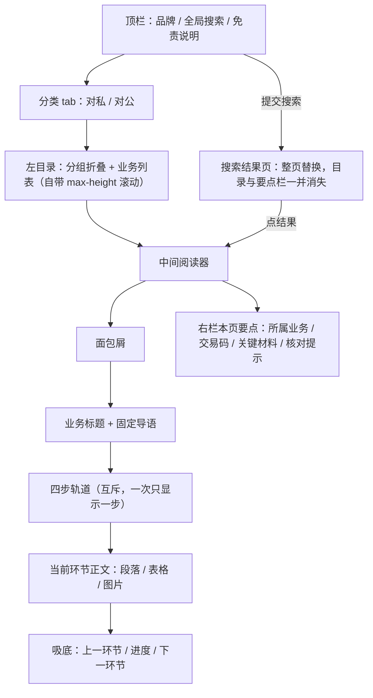
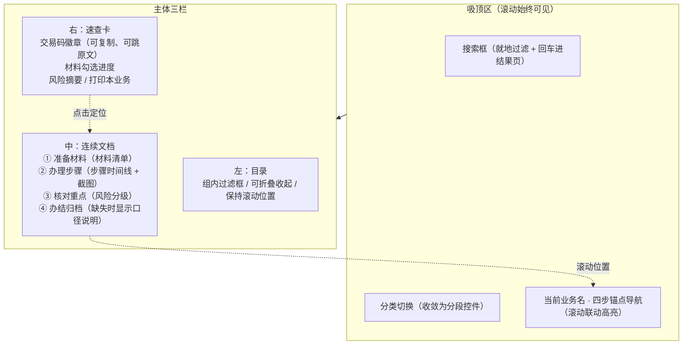
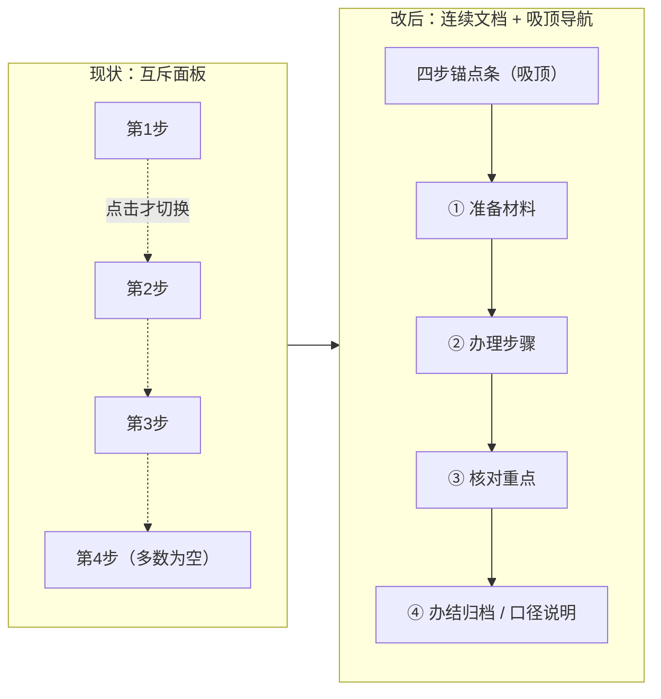

# 新员工业务手册网站 UI 改版方案

- 文档性质：设计沿革；初稿 v1（2026-08-25），当前阅读布局 v1.8.2（2026-09-28，基础见 §13，最新调整见 §14–15）
- 对应实现：`index.html` / `styles.css` / `app.js`；各节中的“本轮”指该节所记历史版本，当前布局以 §13–15 的最新约定为准
- 数据版本：`employee-handbook.js`，来源手册 2026-02-05 版
- 受众与场景：银行网点新员工，在**柜面办理业务时快速查阅对照**（次要场景：上岗前通读学习）

---

## 0. 硬性约束声明（本方案全部条目均在此前提下成立）

1. **零依赖纯静态**：不引入任何框架、构建工具、包管理器、CDN 资源或字体外链。产物仍是 `index.html` + `styles.css` + `app.js` + 现有数据与图片。本文档中的 mermaid 代码块**仅用于方案示意，不进入产品**。
2. **离线 `file://` 双击可用**：不使用 `fetch`/`XMLHttpRequest` 加载本地文件，不使用 ES Module（`file://` 下 CORS 受限），不依赖 Service Worker；所有涉及安全上下文的 API（剪贴板、`localStorage`）必须有降级路径（详见 §4）。
3. **不改变手册制度口径与原文内容**：`employee-handbook.js` 一个字不动；所有改动只在展示层。任何"结构化""卡片化""流程图化"都只是**重排版与重强调**，不改写、不合并、不删减、不重新排序原文语句。新增「原文对照」开关，让柜员可随时切回未加工的原始段落自检（见 §4.9）。
4. **保留现有 hash 深链**：`#/<结构索引key>/<环节序号>` 格式不变，旧链接（含指向空环节的旧链接）行为不倒退。
5. **保留四步阅读模型**：准备材料 → 办理步骤 → 核对重点 → 办结归档，四个环节的划分口径不变；**仅改变其呈现方式**（从"互斥面板"改为"连续文档 + 吸顶定位"，见 §2.4）。
6. **主色**：建议继续沿用深红 `#a62031` 作为品牌与主操作色（理由与用法调整见 §2.5），不做整体换色。

---

## 1. 现状梳理

### 1.1 内容形态实测（本次通过脚本统计得出，作为设计依据）

> **2026-08-25 数据补齐后刷新**：本表数字全部基于重新生成的 `employee-handbook.js`（补回 542 个 `"shape":true` 形状文本块约 3.5 万字、恢复 Word 自动编号前缀、重复业务已在数据层合并）重算，与更早版本的统计不可直接比较。「行」= 普通块按整块计一行，形状块按 `\n` 拆行后逐行计。

| 指标 | 实测值 | 对设计的含义 |
| --- | --- | --- |
| 分类 / 业务节点 | 2 类（常见对私 58、常见对公 23），结构节点 **110**，其中**可读业务 81 个** | 规模小，无需分页与预建索引，全量实时检索足够 |
| 一级分组 | 对私 4 组、对公 3 组 | 目录只有两层，左栏折叠层级已足够，不必再加层 |
| 块总数 | **1657**：段落 **1643**（含 7 个 `notice` 提示块）、表格 **7**（其中 **4 个 `rows` 为空**，当前静默不渲染） | 表格是稀缺资源，值得做精；空表格需在 QA 中显式暴露 |
| 形状文本块 | **542 块**（占全部块 33%），合计 **35 244 字**；其中 **196 块含 `\n` 为多行**，346 块为单行 | **整块渲染成一个 `<p>` 会把一整套步骤压成一坨**；渲染前必须按 `\n` 拆行 |
| 段落长度 | 块级中位 **21 字**，P90 103，最长 644；拆行后共 **2163 个非空行**，行级中位 **20 字**，P90 71，最长 495 | **绝大多数"段落"其实是短条目**，当成 `<p>` 逐条堆叠会产生大量空白与"碎行感" |
| 编号行 | **995 行**（块级 626 + 形状块内 369）：`1.` 式 **568**、`一、` 式 **251**、`①` 式 **149**、`（1）` 式 **18**、`(一)` 式 **6**、`1)` 式 **3** | 天然可成组渲染为有序列表 / 时间线，可视化改造有真实数据支撑 |
| 「标签：内容」冒号行 | 完整定义行 **284 行**（块级 219 + 形状块内 65）；另有**行尾冒号（内容为空）248 行**（块级 89 + 形状块内 159） | 可渲染为「标签 — 值」定义行，替代当前一律 `<p>`；行尾冒号那批按小节标题处理 |
| 纯标题行 | **465 行**：编号式（中文序号 / 括号中文序号起头）**221**、标签词式（审核材料 / 操作流程…）**244** | 这才是真正该升级为 `h3` 的行，当前 `isHeading()` 判成 `h4` 的多数不是它们 |
| 图片 | 引用 **125 处**（分布在 **87 个块**），实际文件 **114 张**，16 MB | 是本手册最高价值的资产，值得独立的画廊 + 灯箱 |
| 有图注（"图一…"）的图片块 | 现行提取规则仅 **8 / 87 块**（覆盖 12 / 125 张图） | 其余 79 块、113 张图只能显示"原始操作图 N"这种无信息量的兜底文案 |
| 无图业务 | 39 / 81；单业务最多 17 张图 | 版式必须同时兼顾"纯文字"与"图海"两种极端 |
| 图片尺寸 | 混合：单据竖版 1068×1629、系统截图 1042×598、小图 388×231 | 当前 `img{width:100%}` 会把 388px 宽的小图**强行放大到列宽而糊掉** |
| 四步填充度 | 空环节数：准备 **4**、办理 **1**、核对 **8**、**归档 74** | **办结归档对 91% 的业务是空的**；6 个业务是完整四步、64 个三步、10 个两步、1 个一步 |
| 每步内容量 | 准备 **440** 块 / 办理 **597** / 核对 **601** / 归档 **19** | 前三步体量相当，归档几乎不存在 |
| 单业务体量 | 最多 **162 块**（"三方签约、解约、变更"）、最多 17 张图 | 连续文档形态下的单页 DOM 上限，需按此做滚动性能验证 |

### 1.2 现状交互流程



关键机制：任何一次点击（切分类 / 切业务 / 切环节 / 搜索）都会执行 `view.innerHTML = ...` **整片重建**，包括左目录和右要点栏。这是下面多条体验问题的共同根因。

### 1.3 各区块体检

| 区块 | 现在怎么用 | 现存体验问题 | 严重度 |
| --- | --- | --- | --- |
| 顶栏搜索 | 输入关键词回车 → 整页切到搜索结果页 | 不吸顶，一滚就消失；柜面高频动作却需要滚回顶部；无输入即时反馈、无历史、无"清空"按钮；搜索是"跳走"而不是"就地过滤"，丢失当前上下文 | 高 |
| 分类 tab | 两个 tab 切对私/对公 | 只有 2 项却占满一整条 54px 横栏，信息密度极低；切 tab 会把已选业务清空并回到第一条，等于"丢失现场"；同样不吸顶 | 中 |
| 左目录 | 分组 `<details>` 折叠 + 业务按钮，标注"N 步" | 桌面端自带 `max-height` 内滚动 + 页面本身滚动 = **双滚动条**，柜员容易滚错区域；**每次切环节目录都被整片重建，滚动位置归零**（实测 200 → 0）；58 项无法在目录内过滤；"N 步"含义模糊（是"有内容的环节数"，不是操作步数），易被误解为办理步数 | 高 |
| 面包屑 | 显示完整路径 | 与右栏「所属业务」、与 H1 三处重复同一信息；在 820px 下换行占两行，纯属噪声 | 低 |
| 四步轨道 | 点击切换互斥面板 | **一次只能看一步**，而柜面最需要的是"材料 + 步骤 + 注意事项同屏对照"，被迫来回点；轨道连接线在"置灰空环节"处仍然连通，暗示"走得通"；轨道用 `<button>` 但无 tab 语义与方向键；未选中文字对比度仅 3.09:1 | 高 |
| 正文 | 段落 / 表格 / 图片顺序渲染 | **层级颠倒**：`isHeading()` 把"审核材料：客户有效身份证原件…"这类**内容行**判成 `h4`，于是连续四五行都是"红竖条 + 加粗大字"，页面呈条码状，真正的小节标题反而不突出；短行各自成段导致行间距浪费；无 h3，标题层级从 h2 直接跳到 h4 | 高 |
| 图片 | 网格 + 点击在新标签页打开原图 | 新标签页打开原图 = 离开手册、丢失位置、返回要重新定位；小图被拉伸变糊；竖版单据与横版截图混排导致网格高度参差；79 个图片块、113 张图的图注是"原始操作图 N"；图与它所解释的那一步在视觉上没有绑定 | 高 |
| 表格 | `<table>` + 横向滚动 | 无 `<th>`/`scope`，读屏无表头关联；`tr:first-child` 靠位置假定表头；无斑马纹、无冻结表头/首列；Word 合并单元格被摊平成重复值（如"手工比对录入信息"连续重复 9 行，白占约四分之一宽度）；`min-width:620px` 在手机上必然横滚且无滚动提示；4 个空表格块静默消失 | 中 |
| 底部环节切换 | 吸底"上一/下一环节" | 是页面上**唯一**吸附的元素，视觉权重却最高（大红按钮），与"当前 1/4"文案组合信息量偏低；移动端与内容争抢屏幕高度 | 中 |
| 右栏要点 | 自动提取交易码 / 关键材料 / 核对提示 | **提取质量有硬伤**：交易码正则 `\d{5,8}` 只排除相邻数字、不排除相邻字母，`G04003` 被截成 `04003`、`E16701` 被截成 `16701`——全部 216 个命中数字串里 **114 个（53%）是字母前缀交易码的残缺尾巴**，展示出来的是一个**错的码**；另有 `95566`（客服热线）、`50000`（"≤50000 美元"金额）这类纯误报被当成交易码展示（76/81 业务命中），在柜面把误报当权威展示是业务风险；「核对提示」第一条常是"三.业务完结注意事项"这种小标题（73/81 命中中 11 个业务首条即小标题，47 个业务的三条里至少有一条是小标题）；材料仅取"审核材料：…"后的一段并按顿号切分（65/81 命中），长句会被截断；三块内容都是"只读文本"，没有勾选、没有复制、点不动、跳不回原文 | 高 |
| 搜索结果页 | 整页列表 | 只显示标题 + 路径，不显示命中上下文；`em`"打开业务"在手机被隐藏；无"按分类筛选""按交易码精确匹配"；无结果时无推荐 | 中 |
| 空环节 | 已改为置灰 + `disabled` + `title` 提示 | 方向正确，但**归档对 74/81 业务恒空**，四步轨道有四分之一是"永远的死格"；`disabled` 会让该按钮脱离 Tab 序列，读屏用户完全感知不到"原手册未单列"这条重要口径信息 | 中 |
| 移动端（<820px） | 单列纵向堆叠 | **首屏被"品牌 + 搜索 + 分类 tab + 310px 高目录"占满，正文要滚 1000px 以上才开始**（实测 375×812）；目录常驻展开而非抽屉；吸底条再吃掉一截高度；11–12px 小字过小 | 高 |
| 打印 | 无打印样式 | 直接打印会带出顶栏、目录、右栏、按钮；且**互斥面板意味着只能打印当前一步**，无法打出一张"单业务对照单" | 中 |

### 1.4 五条可复现的实测证据

1. **目录滚动归零**：把左目录滚到 200px，点击"办理步骤"，目录 `scrollTop` 回到 0。
2. **焦点丢失**：同一次点击后 `document.activeElement` 变成 `<body>`，键盘用户的位置彻底丢失，需要重新 Tab 十余次。
3. **内容行被当标题**：`开客户号 → 准备材料` 中，"审核材料：…""填写单据：…""填单图样："三行连续渲染为红竖条 `h4`。
4. **表格重复列**：`开客户号` 的证件录入规则表首列 9 行全是"手工比对录入信息"。
5. **对比度不达标**（白底实测）：步骤条未选中 3.09:1、目录条目步数 3.01:1、图注计数 3.05:1、页脚 3.57:1、吸底进度文案 3.77:1、搜索副标题 3.83:1、面包屑 3.98:1，置灰环节 2.18:1。WCAG AA 正文要求 4.5:1。品牌红 `#a62031` 对白为 7.31:1，是现有配色里最稳的一环。

---

## 2. 设计方向

### 2.1 方向 A：银行制式工作台风（Counter Workbench）

把页面当作一个**柜面速查终端**而非网页：三栏常驻、吸顶导航、紧凑网格、13–15px 字阶、以分隔线和底色分区（少用卡片阴影），右栏升级为可交互的「办理清单」。

- 适用理由：与柜员日常使用的核心/前端系统心智一致；单屏承载信息最多，最贴合"边办边对照"；紧凑布局让 81 个业务的目录与正文能同屏。
- 取舍：密度高，排版稍有松懈就会显得压抑、"像老系统"；对字阶、行高、留白的纪律要求最高；新员工首次打开的"亲和度"不如极简风。

### 2.2 方向 B：阅读器极简风（Minimal Reader）

单列宽正文，弱化甚至隐藏目录与右栏（按需唤出），大留白、大图、大标题，专注逐行阅读。

- 适用理由：改动最小、观感最"干净"；最适合上岗前通读学习；移动端天然友好。
- 取舍：**与核心场景相悖**——柜面需要同屏对照，极简风把材料、步骤、注意事项拉成一条长路径，反而增加滚动与记忆负担；右栏速查价值被牺牲；信息密度低意味着同样内容要滚更久。

### 2.3 方向 C：卡片流程风（Card Flow）

每个业务渲染成一条纵向流程：材料卡（可勾选）→ 步骤节点卡（编号 + 截图缩略）→ 风险卡（分级配色）→ 归档卡，卡片之间用时间线连接。

- 适用理由：可视化程度最高，最直观地回答"我现在做到哪一步"；移动端体验最好；与用户"更可视化"的诉求最贴合。
- 取舍：卡片的边框 + 内边距会吃掉 20–30% 有效空间，在 81 个业务里**只有部分业务的原文具备清晰步骤结构**（995 个编号行分布不均，成组的只有 638 行 / 210 组），结构不足的业务会渲染出"一张卡里塞一大段"的畸形卡片；强行套结构还有"看起来像改写了原文"的合规观感风险。

### 2.4 推荐方向：**A 为骨架 + C 为元件**，命名「柜面速查工作台」

即：**整体沿用工作台式三栏与紧凑节奏（A）；在正文内部，凡是原文结构支持的地方就升级为流程时间线、材料清单、风险标识等可视化元件（C）；结构不支持时优雅回退为干净的段落（B 的排版素养）。** 方向 B 不作为整体方向，而是收敛成一个「专注模式」开关（一键收起目录与右栏，进入宽单列阅读），服务上岗前通读场景。

推荐理由：

1. **场景决定密度**。用户明确场景是"柜面办理业务时快速查阅对照"，"对照"意味着**同屏**。三栏 + 连续文档能做到；单列阅读器做不到。
2. **可视化要有数据支撑，不能凭空造结构**。995 个编号行、284 个「标签：内容」定义行、465 个纯标题行、125 处图片引用是真实存在的结构线索，值得升级；而对结构薄弱的业务，"回退为好看的段落"比"硬塞进卡片"更诚实，也更符合"不改口径"的约束。
3. **一处结构变更同时解决三个问题**。把四步从"互斥面板"改为"**连续文档 + 吸顶四步导航（滚动联动高亮）**"后：柜面可同屏对照；打印天然能打出完整的单业务对照单（四段都在 DOM 里）；`role=tab` 那套复杂的键盘语义可以退化为更稳妥的"锚点导航 + `aria-current`"。深链语义从"显示第 N 步"变为"定位到第 N 步"，**hash 格式与旧链接全部保持有效**。



四步呈现方式的前后对比：



### 2.5 配色主张：保留深红，改变红色的"职责"

**保留 `#a62031` 作为主色**，理由：品牌识别与银行语境契合；对白 7.31:1 是现有色板中最稳的；已写入 `theme-color`、启动脚本与用户认知，换色收益低而风险高。

**要改的是红色的用法。** 现状里红色同时承担了品牌、当前分类、当前环节、每个内容行的左竖条、风险提示五种职责，**红得越多，红就越不表示"重要"**。建议收敛为：

| 语义 | 建议色（浅底 / 文字） | 用在哪 |
| --- | --- | --- |
| 品牌 / 当前位置 / 主操作 | `#a62031`（深红） | 品牌名、当前分类、当前环节、主按钮 |
| 结构与正文 | `#1f2a35` / `#3c4a55` / `#5c6975` | 标题、正文、次要文字（次要色需 ≥4.5:1，替换现有 3.0–3.9:1 的灰） |
| 信息 / 系统操作 / 交易码 | 深蓝 `#12507f`（对白 7.4:1 量级） | 交易码徽章、系统菜单路径、"操作提示" |
| 注意 / 需核对 | 琥珀 `#8a5a00`，浅底 `#fff8ea` | 二级风险标识、空环节口径说明 |
| 禁止 / 强制 | 深红 `#a62031`，浅底 `#fdf1f2` | 一级风险标识（"不得""严禁""必须""务必"） |
| 完成 / 已勾选 / 归档 | 深绿 `#1d6b4f` | 材料勾选态、办结归档节点 |

配套：把所有低于 4.5:1 的辅助灰整体上调一档；小字号下限从 11px 提升到 12px（移动端 13px）；红色不再用于正文行的左竖条（改用中性分隔或序号）。

---

## 3. 逐区块改动建议

> 量级说明：**小** = 主要改 CSS，改动约 10–40 行；**中** = CSS + 少量渲染函数调整，约 40–120 行；**大** = 渲染结构或状态管理变更，约 120 行以上并需回归测试。

| # | 区块 | 具体改法 | 量级 |
| --- | --- | --- | --- |
| 3.1 | 顶栏 | 顶栏 + 分类 + 四步锚点合并为一条 `position:sticky` 的「工作台头」，滚动时压缩为紧凑一行（品牌缩为短标识、搜索框保持可用）；搜索框加清空按钮、`/` 快捷键聚焦、`aria-label` 完整；"仅供内部学习参考"移到页脚，头部只留业务信息 | 中 |
| 3.2 | 分类 tab | 从整条横栏收敛为**分段控件**（两枚按钮，宽度自适应），并入工作台头；切换分类时**保留当前业务**（若目标分类内无对应项才回落到首项），并保留滚动与折叠状态 | 中 |
| 3.3 | 左目录 | ① 顶部加「过滤业务」输入框，实时过滤 58/23 项（纯前端字符串匹配，命中高亮）；② 目录**独立于正文渲染**，切环节/切业务时只更新选中态，不重建 DOM，滚动位置与折叠状态得以保留；③ 取消目录自身的 `max-height` 内滚动，改为整栏 `position:sticky` + `overflow:auto` 满高，消灭双滚动条；④ "N 步"改为更明确的标注（如显示实际有内容的环节点阵 `●●●○`，hover 出文字说明）；⑤ 增加「收起目录」按钮，正文可扩至更宽 | 大 |
| 3.4 | 面包屑 | 缩为一行、可点击（点分类回分类、点分组展开目录对应组）、超长中段省略；与右栏「所属业务」二选一，删除右栏重复项 | 小 |
| 3.5 | 四步轨道 | 改为**吸顶锚点条**：点击平滑滚动到对应段落，滚动时以 `IntersectionObserver` 联动高亮；节点标注实际内容量（如"12 条 · 3 图"）；空环节保留在条上但呈"虚线 + 未单列"样式，且**可聚焦、可读屏**（用 `aria-disabled` 而非 `disabled`）；连接线在空节点处改为虚线，避免"走得通"的暗示 | 大 |
| 3.6 | 正文层级 | ① 重写标题判定：只有"一.客户环节""三.业务完结注意事项"这类**纯标题行**（无冒号内容、长度短、以中文序号或标签词起头）才是小节标题，渲染为 `h3`（实测 465 行）；② "标签：内容"的 284 个定义行渲染为**定义行**（标签小字加粗置左、内容常规），不再是红竖条大标题；另有 248 个行尾冒号行（内容为空）并入①按小节标题处理；③ 995 个编号行中**连续成组的 638 行（210 组）**合并渲染为有序列表/时间线，落单的 357 行按自身形态渲染（小节标题 226、普通段落 122、定义行 9），不强行成组；④ 542 个形状文本块先按 `\n` 拆行再逐行归类，不再整块塞进一个 `<p>`；⑤ 正文最大宽度 68–76 字符，行高 1.75，段间距按"是否同组"区分；⑥ 补 `h2`→`h3`→`h4` 完整层级 | 大 |
| 3.7 | 图片 | 统一缩略图瓦片（固定宽高比 + `object-fit:cover` + `object-position:top`），点击开**站内灯箱**（保留"在新标签页打开原图"为次要入口）；图注按「下一行"图一/图二…" → 图片块自带文字 → 紧邻上一条以"图样/截图/界面"收尾的正文行」的优先链取值（当前 79/87 块、113/125 张图只能显示"原始操作图 N"；新链可覆盖 25/87 块，其余仍诚实兜底——**无条件取上一行会给 27/87 块配上明显不是图注的正文句子，不采纳**）；小图不放大（`width:auto;max-width:100%`）；图片绑定到它所解释的步骤节点下 | 大 |
| 3.8 | 表格 | 斑马纹、行 hover、`th scope="col"`（仅当首行判定为表头时）、`position:sticky` 冻结首行与首列、左右滚动阴影提示、**重复首列视觉合并**（连续相同值只在首行显示，其余留白并加连接线）、`<caption>` 取自紧邻上一行文字、空表格块在开发模式下提示（生产静默） | 中 |
| 3.9 | 底部环节切换 | 连续文档后，吸底条降级为**轻量返回条**：左"回到目录"、中"当前环节"、右"下一环节"；桌面端仅在向下滚动时显示，移动端常驻但高度压到 52px；主色大按钮只保留一个 | 中 |
| 3.10 | 右栏 | 重构为「速查卡」：交易码徽章（可复制、点击定位原文）、材料勾选清单 + 进度、风险摘要（按级别着色，剔除"三.业务完结注意事项"这类小标题行）、「打印本业务」「专注模式」按钮；每条要点都可点击跳回正文出处；顶部保留"以下要点由原文自动提取"的显式声明 | 大 |
| 3.11 | 搜索结果页 | 保留整页结果（回车触发），但补：命中上下文片段（前后各 30 字 + 高亮）、按分类分组、交易码精确匹配置顶、结果内键盘上下选择 + 回车打开、"没有结果"时给出相近业务推荐 | 中 |
| 3.12 | 空环节 | 归档等空环节在正文中显示一条**口径说明条**（"原手册在此业务中未单列该环节内容，请按所在机构归档要求执行"），而不是完全消失——保证"四步"这一制度框架在每个业务上都可见可解释 | 小 |
| 3.13 | 页脚 | 补充数据版本与来源（手册 2026-02-05 版）、页面版本号，便于柜面追溯 | 小 |

---

## 4. 可视化增强专章

每项均给出零依赖纯静态（且 `file://` 可用）的实现思路。

### 4.1 材料清单卡片化 / 勾选化

- **做什么**：把「准备材料」环节里"审核材料：A、B、C""填写单据：《X》《Y》"等行，渲染成带复选框的清单卡；顶部显示"已备齐 3/5"。
- **实现**：渲染时对冒号行做切分（`、` `，` `；`），每项包一个 `<label><input type="checkbox">`；**原句完整保留**在卡片脚注"原文"折叠里，确保口径可核。勾选状态存 `localStorage`，键为 `hb:check:<nodeKey>`，页面提供"清空勾选"；`file://` 下 `localStorage` 在个别浏览器会抛 `SecurityError`，用 `try/catch` 包裹并回退到内存态（刷新即失效，不影响使用）。
- **风险**：切分可能把"《个人税收居民身份声明文件（2025年版）》(无纸化可免填单)"这类含标点的长项切碎——处理办法是括号内不切分，且切分后长度 <2 字的项合并回上一项；无法可靠切分时整行作为单条。

### 4.2 办理步骤流程图化（纵向时间线）

- **做什么**：把「办理步骤」里连续的编号行渲染为纵向时间线：左侧序号圆点 + 连接线，右侧步骤文字，该步骤后紧跟的截图作为该节点的缩略图。
- **实现**：纯 CSS——`ol { counter-reset }` + `li::before` 画圆点、`li::after` 画连接线；不需要任何绘图库。分组规则：从原文块序列中取**连续**的编号行为一组，遇到非编号行即结束该组，保证顺序与原文完全一致。
- **风险**：编号行分布不均（995 行散落在 81 个业务，只有 638 行能连成 210 组；组长分布：2 行 92 组、3 行 61 组、4 行 30 组、5 行 16 组、6 行 6 组、7 行 5 组），落单编号行与无编号的业务回退为普通段落——这是预期行为，不做强行套用。

### 4.3 交易码徽章化 + 一键复制

- **做什么**：正文中出现的交易码渲染为等宽徽章（深蓝），点击复制并就地提示"已复制"；右栏徽章点击后**滚动定位到原文出处**并短暂高亮。
- **实现**：渲染文本时用正则包裹数字串；复制优先 `navigator.clipboard.writeText`，**`file://` 不是安全上下文，该 API 会不可用**，因此必须保留 `document.execCommand('copy')` + 隐藏 `textarea` 的兜底路径，两者都失败时改为"选中该文本"并提示手动复制。
- **口径风险（重要）**：当前 `(?<!\d)\d{5,8}(?!\d)` 只挡数字、不挡字母，在新数据上取到 216 个不同数字串，其中 **114 个（53%）是 `G04001` `E16701` `S00001` `C01060` 这类字母前缀交易码被截掉首字母后的残缺尾巴**——展示的是一个错的码，比不展示更危险；另有 `95566`（客服热线）、`50000`（"≤50000 美元"）、`9991003`（BGL 账户号）等纯误报。建议：① **先把正则改成 `(?<![0-9A-Za-z])([A-Za-z]?\d{5,8})(?![0-9A-Za-z])`**，一处改动即修复全部 114 个截断（实测右栏徽章从 `04001 / 8101100 / 38011` 变为 `G04001 / 8101100 / E38011`，与业务标题自带的交易码完全对上）；② 再加一条极小的剔除表：紧跟"美元/元/万"等金额单位的、以及 `95566` 这类客服热线号；③ 右栏标题从「相关交易码」改为**「原文中出现的编号」**并注明"取自原文，请以系统实际交易码为准"；④ 优先采信"办理步骤"环节中、且邻近"交易码/交易/菜单/输入"等词的数字；⑤ 每个徽章都能跳回原文，让柜员自行判读，而不是替他判读。

### 4.4 表格斑马纹与冻结表头

- **实现**：`tbody tr:nth-child(even){background:#fafbfc}`；表头 `position:sticky; top:<吸顶头高度>`（配合 CSS 变量传递吸顶高度）；首列 `position:sticky; left:0` + 右侧阴影；重复首列的"视觉合并"用 JS 在渲染时比对相邻行首列文本，相同则给该单元格加 `.is-repeat` 类、隐藏文字但保留可访问文本（`sr-only`），读屏仍能读到完整值。
- **风险**：`position:sticky` 在滚动容器内需要容器不设 `overflow:hidden`；表格仅 7 个（4 个为空），实际受益面小但成本也低。

### 4.5 截图画廊与灯箱

- **做什么**：同一业务的全部截图在右栏/环节末尾提供"胶片条"；点击任意图进入灯箱：大图、上一张/下一张、缩放（点击或 `+`/`-`）、图注、"打开原图"、`Esc` 关闭。
- **实现**：优先用原生 `<dialog>` + `showModal()`（自带焦点陷阱与 `Esc`），不支持时回退为 `div` 覆盖层 + 手写焦点陷阱；图片仍是本地相对路径，`file://` 正常加载；相邻图预取用 `new Image().src`；打开时记录触发元素，关闭后把焦点还回去；开合时缩略图原位放大 / 缩回（2026-09-27 加，§12），回退覆盖层与 `prefers-reduced-motion` 下瞬开瞬关。
- **要点**：**保留"在新标签页打开原图"链接**（柜员有时需要单独放大或打印一张单据样张），只是不再作为唯一入口。

### 4.6 核对重点的风险标识分级

- **做什么**：核对重点内的每条按关键词分三级着色：
  - 一级（红）：不得 / 严禁 / 禁止 / 必须 / 务必 / 责任重大
  - 二级（琥珀）：注意 / 核对 / 确认 / 审核 / 复核 / 提醒
  - 三级（中性）：其余说明性内容
- **实现**：渲染时对整行做关键词命中判定，加类名；样式仅为左侧色条 + 小标签（【禁止】【注意】），**文字一字不改**。提供"关闭重点标识"开关。
- **风险**：关键词判定必然有误差，因此标识必须做成"弱提示"（不是遮罩、不是折叠），并允许关闭；绝不因分级而隐藏任何内容。

### 4.7 目录点阵与业务概览

在目录每条右侧用四个小点表示四个环节的填充情况（`●●●○`），hover/焦点时读出"准备、办理、核对有内容，归档未单列"。让柜员在打开业务前就知道内容深浅。纯 CSS + `aria-label`，成本极低。

### 4.8 最近查看与常办业务

顶部提供"最近查看"（最多 8 条）与"标星常办"，存 `localStorage`（同 4.1 的降级策略）。柜面高频业务通常集中在十几个，这一项对实际效率的提升可能高于任何视觉改动。

### 4.9 「原文对照」开关（合规兜底）

一个开关把当前业务切换为**未加工视图**：原始块顺序、原始文字、无重排无标识，仅保留基本可读排版。用于柜员核对"网页有没有改动手册"，也便于将来数据更新后的回归检查。实现成本低（渲染分支），但对"不改口径"这条约束是关键的信任保障。

---

## 5. 响应式与打印

### 5.1 断点与形态

| 断点 | 形态 | 关键改动 |
| --- | --- | --- |
| ≥1440px | 三栏（目录 300 / 正文自适应 / 速查卡 300） | 正文最大宽度限制，避免行长过长 |
| 1120–1440px | 三栏，目录与速查卡收窄；提供"收起目录" | 修正现状中"右栏在 1120 以下被塞到正文下方变成三宫格"的怪异中间态 |
| 820–1120px | 两栏（目录抽屉化 + 正文），速查卡变为正文顶部的**横向要点条**（交易码 + 材料数 + 风险数，可展开） | 中间态从"降级"变为"重排" |
| <820px | 单列 | 见下 |

### 5.2 <820px 手机形态改良（当前最大痛点）

1. **首屏必须是内容**。品牌 + 搜索 + 分类 + 310px 目录共占据整个首屏的问题，通过把目录改为**抽屉**（底部弹出，带过滤框、记忆滚动位置与折叠状态）、分类并入抽屉顶部、顶部只留"品牌缩写 + 搜索图标 + 当前业务名 + 四步锚点"一条 56px 吸顶栏来解决。
2. **只保留一个吸附条**。顶部四步锚点条（横向可滚）保留，吸底改为单个"下一环节"浮动按钮（56px 圆角），不再是三栏栅格。
3. **字号与触控**：正文 15px（不再降到 14px），辅助字 ≥13px，所有可点元素 ≥44×44px。
4. **表格**：默认横向滚动 + 首列冻结 + 滚动阴影，并提供"全屏查看表格"（旋转/铺满）。
5. **图片**：单列，点击进灯箱，灯箱内允许双指缩放（`touch-action:pinch-zoom`）。
6. **面包屑**：折叠为"上级 › 当前"两级。

### 5.3 打印样式（柜面打印单业务对照单）

- 触发：速查卡内「打印本业务」按钮 → `window.print()`。
- `@media print` 规则：
  - 隐藏顶栏、分类、目录、速查卡、所有按钮与吸附条；
  - **四个环节全部展开**（连续文档模型下天然满足；若保留互斥面板，则需 `beforeprint` 事件临时渲染全部环节，`afterprint` 还原——这是推荐连续文档的又一理由）；
  - 页眉：业务全路径 + 手册版本（2026-02-05）；页脚：`@page` 页码 + 打印日期 + "实际办理请以最新制度、系统提示及所在机构要求为准"；
  - 表格 `thead { display:table-header-group }` 跨页重复表头，`tr, figure, li { break-inside:avoid }`；
  - 图片按 `max-height:8cm` 收敛，避免一张截图独占一页；提供"打印时包含截图"勾选（默认包含，纯文字打印更省墨）；
  - 颜色降噪：红色左条改为黑色细线，风险标识改为文字标记【禁止】【注意】，保证黑白打印不丢信息；
  - 链接后不追加 URL（离线场景无意义），但页脚打印当前 hash 深链，便于回到同一业务同一环节。

---

## 6. 无障碍与使用标准

在近期已修正的"嵌套 `main`、`aria-current`、去除残缺 tab 角色"基础上继续：

### 6.1 焦点管理（当前最严重的缺口）

- **问题**：每次交互整片 `innerHTML` 重建，焦点掉到 `<body>`（已实测）。
- **改法**：① 目录、速查卡与正文分离渲染，只更新变化部分；② 必须整片重建时，重建后把焦点还给"等价元素"（如刚点击的环节按钮）；③ 灯箱与抽屉打开时记录触发元素，关闭后归还焦点；④ 提供"跳到正文"跳转链接（`skip link`），首个 Tab 即可越过导航。

### 6.2 键盘导航

- `/` 聚焦搜索、`Esc` 清空搜索/关灯箱/关抽屉（输入框内不劫持；搜索联想浮层开着时第一下 `Esc` 只收浮层、保留框内文字，下一下才清空，见 §11.3；输入法合成中的按键一律归输入法，见 §11.4）；
- `[` `]` 上/下一环节；`g` + `d` 打开目录抽屉（可选）；
- 目录内 `↑↓` 移动、`Enter` 打开、首字母跳转；
- 灯箱内 `←→` 切图、`+/-` 缩放、`Esc` 关闭，焦点被限制在灯箱内；
- 搜索结果列表 `↑↓` + `Enter` 直达；搜索框边输边出联想浮层，浮层开着时 `↑↓` 在联想间移动、`Enter` 直接打开选中的业务，一条都不选直接 `Enter` 照旧提交进结果页（§11.3）；
- 提供 `?` 快捷键说明面板（纯静态列表）。

### 6.3 读屏语义

- 四步锚点条用 `<nav aria-label="业务办理环节">` + 链接 + `aria-current="true"`（连续文档模型下不用 tab 角色，避免语义半成品）；
- 空环节改用 `aria-disabled="true"` + `tabindex="0"` + 可读文本"原手册未单列"，**不再用 `disabled` 把这条制度信息藏起来**；
- 环节切换与搜索结果数用 `aria-live="polite"` 播报（"已定位到 第2步 办理步骤"、"找到 7 个结果"）；搜索联想的条数走同一个播报区，停手约 400ms 后只播最后一次（"6条联想，上下键选择"，§11.3）；
- 表格补 `<caption>`（可 `sr-only`）与 `th scope`；重复列视觉合并后保留 `sr-only` 全文；
- 图片 `alt` 使用真实图注（取自邻近原文行），装饰性元素 `aria-hidden`；
- 标题层级连续：`h1` 业务 → `h2` 环节 → `h3` 小节 → `h4` 子项；
- 勾选清单用真实 `<input type="checkbox">` + `<label>`，不用 `div` 模拟。

### 6.4 视觉标准

- 全站文本对比度 ≥4.5:1（辅助小字亦然），非文本控件边界 ≥3:1；把 §1.4 列出的 3.0–3.9:1 的七处灰色全部上调；
- 焦点环保持现有 3px 但改为"外描边 + 内白边"双层，保证在深红按钮与浅底上都可见；
- 200% 缩放下不出现横向滚动（布局按容器宽度而非设备宽度判断），满足 WCAG 1.4.10 回流要求；
- 触控/点击目标 ≥24×24px（移动端 ≥44px）；
- 尊重 `prefers-reduced-motion`（已有）与 `prefers-contrast`（新增高对比变量组，柜面强光/老旧显示器场景实用）；
- 参照标准：WCAG 2.1 AA 与 GB/T 37668-2019（互联网内容无障碍）作为验收基线。

### 6.5 金融场景的"使用标准"补充

- **版本可追溯**：页面与打印件均显示手册版本（2026-02-05）与站点版本；
- **口径不可篡改的可核性**：§4.9 的「原文对照」开关；
- **自动提取内容必须标注来源与免责**：右栏每一块都保留"由原文自动提取，完整表述以正文为准"的说明，交易码另加"以系统实际显示为准"；
- **不引入任何联网请求**：确保内网/离线环境下无外部依赖、无遥测（现状已满足，需在 QA 清单中固化为一条检查项）。

---

## 7. 分期实施计划

> 工作量按单人开发估算（含自测）。改动仅涉及 `index.html` / `styles.css` / `app.js` 三个文件，数据文件不动。

### 一期「够用」——把现有形态做扎实（约 2–3 人日，改动约 350–500 行）

| 条目 | 说明 | 涉及 |
| --- | --- | --- |
| 设计令牌重建 | 色板（§2.5）、字阶、间距、圆角、阴影收敛为 CSS 变量；修复全部对比度不达标项 | CSS ~120 行 |
| 正文层级修复 | 重写标题判定；冒号标签行改为定义行；连续编号行成组；补 `h3` 层级 | JS ~60 行 / CSS ~50 行 |
| 目录与正文分离渲染 | 修复滚动归零与焦点丢失；目录加过滤框；消灭双滚动条 | JS ~90 行 |
| 表格增强 | 斑马纹、冻结首行首列、`th/scope`、重复首列视觉合并、滚动阴影 | JS ~40 行 / CSS ~40 行 |
| 图片与灯箱 | 统一缩略图、真实图注、站内灯箱（`<dialog>` + 回退）、保留原图入口 | JS ~90 行 / CSS ~60 行 |
| 交易码徽章 + 复制 | 徽章样式、复制（含 `execCommand` 兜底）、右栏改称"原文中出现的编号"并加免责 | JS ~50 行 |
| 打印样式 | `@media print` 全套 + 「打印本业务」按钮 | CSS ~70 行 |
| 焦点与跳转链接 | skip link、焦点归还、焦点环双层化 | 小 |

风险点：正文启发式判定（标题 / 标签行 / 编号行）需要用全部 81 个业务、2163 个非空行逐一目检（已产出全量审计清单），避免误判导致原文观感变形；`file://` 下 `<dialog>`、剪贴板、`localStorage` 三处必须实机双击验证；改动集中在渲染函数，需一次完整回归（分类、目录、环节、搜索、深链、前进后退）。

### 二期「增效」——形态升级与可视化落地（约 3–4 人日，改动约 400–600 行）

| 条目 | 说明 |
| --- | --- |
| 连续文档 + 吸顶四步导航 | 四步从互斥面板改为同页四段 + `IntersectionObserver` 联动高亮；hash 语义由"显示"改为"定位"，旧链接全兼容；新增「专注模式」收起目录与右栏、进入宽单列阅读（口径以 §2.4/§3.10 为准） |
| 工作台头 | 顶栏 + 分类 + 四步导航合并吸顶，滚动压缩；分类切换保留当前业务 |
| 材料清单勾选化 | 含进度、清空、原文折叠、存储降级 |
| 步骤时间线 | 编号行成组渲染 + 截图绑定到步骤节点 |
| 风险分级标识 | 三级着色 + 可关闭开关；右栏风险摘要剔除小标题噪声 |
| 右栏改速查卡 | 交易码跳原文、材料进度、风险摘要、打印/专注按钮 |
| 移动端重构 | 目录抽屉、单吸附条、字号与触控标准 |
| 键盘与播报 | 快捷键、`aria-live`、空环节 `aria-disabled` 化 |

风险点：深链语义变更是本方案唯一触及既有契约的地方，需专门的回归用例（旧链接、指向空环节的链接、前进/后退、刷新、收藏）；滚动联动与 hash 同步容易抖动，需节流并区分"用户滚动"与"程序滚动"；连续文档使单页 DOM 变大（最多 162 块 + 17 张图，形状块拆行后单页最多 232 行），需确认低配柜面机滚动流畅（图片保持 `loading="lazy"`）。

### 三期「出彩」——效率与打磨（约 3–5 人日）

| 条目 | 说明 |
| --- | --- |
| 截图画廊 | 业务级胶片条、灯箱内切换与缩放、按环节筛图 |
| 搜索升级 | 命中上下文片段、交易码精确匹配置顶、按分类分组、结果内键盘操作、无结果推荐 |
| 最近查看 / 标星常办 | 本地存储 + 顶部快速入口（对柜面效率提升可能最大） |
| 目录点阵与业务概览 | `●●●○` 环节填充可视化 |
| 高对比 / 深色模式 | `prefers-contrast` 与可选深色，应对柜面强光与老旧屏 |
| 打印精修 | 单业务对照单版式定稿（含"是否含截图"选项） |
| 无障碍审核 | 键盘全流程走查、对比度复测、读屏抽查，出具核验记录 |

风险点：存储类功能在 `file://` 下可能整体不可用，必须做到"功能缺失但不报错、不影响主流程"；深色模式会让 114 张白底截图突兀，需要为图片区保留浅色底板；功能增多后需警惕"工作台变成控制面板"，每加一个开关都要复核首屏是否仍然清爽。

### 验收清单（每期通用）

1. 双击 `index.html` 与 `.command`/`.bat` 在 `file://` 下功能完好，控制台无错误，无任何外部网络请求。
2. 81 个业务全部可打开；重复业务已在数据层合并，不再有两条同名（原「开立、回收存款证明」两条已合为一条），目录中无重名项。
3. 旧 hash 深链（含指向空环节者）均可正确落位；刷新、前进、后退行为正确。
4. 原文与现有版本逐字一致（可用「原文对照」视图与数据文件比对）。
5. 键盘可完成"搜索 → 选业务 → 切环节 → 看图 → 打印"全流程；焦点始终可见且不丢失。
6. 1440 / 1280 / 1024 / 820 / 375 五档视口无横向滚动、无遮挡。
7. 打印预览为一张完整的单业务对照单，含版本与免责信息。

---

## 8. 明确不做的事（边界）

- 不改写、不精简、不重排任何原文语句，不"顺手"修正原稿中的错别字与笔误（如"业务完完结"）——只在展示层做既有的批注剥离，其余保持原样。
- 不引入 mermaid、图标字体、Web 字体或任何第三方资源；图标一律用内联 SVG 或纯 CSS 绘制。
- 不改 `employee-handbook.js` 与 `assets/`，不改抽取脚本的产物格式。
- 不新增服务端、构建步骤或需要 HTTP 服务才能工作的能力。
- 不把自动提取结果（交易码、材料、风险）表述为权威结论，一律标注来源并可回跳原文。
- 例外（2026-09-20）：§9 的 3D 点缀随仓库分发两份本地运行库（three、GSAP）。除这一条之外，本节与 §0 的全部约束照旧成立。

---

## 9. 3D 点缀：案头手册（2026-09-20 增补）

- 来由：屋主要求各工具与主站工具页的 3D 试点用同一种语言（主站把岗岗画成「一本随滚动翻页的纸质手册，垂着红书签」）。技术栈为 WebGL + three + GSAP，由鼠标和滚动触发。
- 前提：搜索、目录、正文阅读三条路径的速度不受任何影响。3D 只做点缀，不承载信息，不新增操作步骤。
- 对 §0.1 与 §8 的有限修订：允许两份**随仓库分发的本地运行库**，均为经典脚本，不走 CDN。它们只在 §9.4 的条件全部满足时才加载。不满足时页面回到 v1.6.1 的样子，DOM 逐项一致。

### 9.1 放在哪：右栏末尾的一本「案头手册」

- **位置**：宽屏三栏形态（>1120px）下，放在右栏 `.page-aside` 的最后一格，`position: sticky` 贴在工作台头下方。速查卡的编号、材料、风险、截图、工具区一格都不挪。读者往下读、速查卡滚出视口之后，右栏原本是一片空白，手册正好从这里滑进来并停住。
- **物件**：一本摊开的纸质手册，程序化建模，没有模型文件，也没有贴图文件。共 8 张可弯曲的书页，前后两块封面板（外面靠书脊一侧包一条书脊色，内面是环衬纸）与一条露在天头地脚的书脊；书签丝带从书脊顶端沿书沟伸出书页下沿一截，尾端剪成燕尾。页面上只有几行程序生成的淡墨横线，**不画任何业务截图或正文**，也不生成任何额外的资源文件。
- **纯装饰**：`aria-hidden="true"`，不可聚焦，不承载信息，读屏与键盘路径不变。

### 9.2 怎么动

| 触发 | 手册的反应 |
| --- | --- |
| 第一次进入视口 | 合着的封面翻开（约 0.8 秒），这就是「翻开手册」的那一下。以画布露出 35% 为准 |
| 滚动阅读 | 书页按本业务的阅读进度一页页翻过：进度 0→100% 对应 8 页，经 140ms 阻尼，与主站同一手感。正在翻的那页弯着翻（书口一侧领先，像被捏着书口翻过去）。进度 = 正文 `article.document` 顶边越过工作台头下沿，到正文底边到达视口底边；正文比视口还短时改看整页滚动 |
| 鼠标在页面上移动 | 手册朝指针方向轻微倾斜（不超过 6°），书签随之轻摆。只在 `(hover: hover) and (pointer: fine)` 下生效 |
| 换业务 | 合上再翻开（约 0.6 秒），然后从新业务的阅读进度接着翻。换业务那一刻手册不在视口里（例如速查卡把它挤到了视口外）就不演这一下，只悄悄合上，下次进入视口时按第一行「翻开」 |
| 静止 | 不跑任何帧（按需渲染） |

### 9.3 长相：与主站工具页同一套纸与水彩

- 着色器自写，不用 three 的写实材质：两三档平涂色阶，背光面掺一点海湾蓝冷影，程序化纸纹颗粒（亮度 ±3%），每个面边缘有一圈略深的「颜料边」，底下是一块柔边假投影 `rgba(74,77,53,.22)`。没有高光，没有实时阴影。
- 颜色全部走 `styles.css` 里的 `--book-*` 令牌，**模型与 `desk-book.js` 不留任何兜底色值：令牌读不到就不画**。
  下面这一组取值是 1.6.0 首版（封面取主站门厅色块 `#D5D4C1`、书脊 `#8B8C6D`、身份色 `#8F1D2C` 只落在书签丝带），
  **1.7.0 已整组换成苹果液态玻璃风那一版、并改为跟随强调色**（六个强调色各一组，以 §10 表 B 为准；
  中途做过一版不随配色变的粉彩红书，已随粉彩整组作废）；换的只有令牌值，本节描述的模型、光照与动画一行未动。
  1.6.0 首版清单（浅色 / 深色，仅作沿革留档）：`--book-cover` `#d5d4c1` / `#2a2e37`，`--book-spine` `#8b8c6d` / `#1b1e25`，
  `--book-shade` `#6e8a93` / `#46606b`，`--book-ribbon` `#8f1d2c` / `#a8283b`，`--book-shadow` `rgba(74,77,53,.22)` / `rgba(0,0,0,.45)`，
  `--book-page` `var(--paper)` / `#a19e94`，`--book-edge` `var(--line-strong)` / `#77736a`，`--book-ink` `var(--ink-3)` / `#46423b`。
  深色下书页刻意不复用 `--paper`（会和右栏底色糊成一片），改用压暗的灰纸——这条约束 1.7.0 仍然成立。

### 9.4 什么时候不出现（降级的终点就是今天的界面）

下列条件自上而下判断，命中一条即停。不出现时，three 与 GSAP 一个字节都不下载。

1. 系统开了「减弱动态效果」。
2. 窗口 ≤1120px（右栏不是常驻栏）、专注模式、搜索结果页、打印。
3. 速查卡工具区的「案头手册」开关设为「关」（存 `hb:desk3d`）。
4. 省流量模式（`saveData`）。
5. 低端设备：`deviceMemory ≤ 2` 或 `hardwareConcurrency ≤ 2`。
6. **两段都拿不到 WebGL2 上下文**（three r163 起只支持 WebGL2）。**2026-09-23 起这一条只剩「拿不到」**——
   「只有软件渲染」不再是不出现的理由，改为走精简档，见下面的 §9.4b。探测分两段做，都在下载运行库之前：
   **严参数**（`failIfMajorPerformanceCaveat: true`，与 1.6.x 逐字相同，有独立显卡的机器在这一段拿到）→
   拿不到就换**宽参数**（只放宽这个标志，同时关掉抗锯齿——软件渲染下多重采样纯吃 CPU）→
   还拿不到就再用宽参数探一次 WebGL 1（只为诊断记进 `status()`，拿到也不做场景，仍算这一条命中）。
   两段都拿不到时**安静回静态**：`status()` 记 `failed / webgl2-unavailable`，控制台一个字都不打，
   运行库一个字节都不下载。Chrome 122 起默认不给 SwiftShader 的 WebGL，`--disable-gpu` 而**不加**
   `--enable-unsafe-swiftshader` 就正好落在这一档（2026-09-23 实测，三种旗标的实测见 §9.7）。
   拿到的那块上下文**不再释放重建**，连同它的画布一起交给 `THREE.WebGLRenderer({ canvas, context })`：
   软件渲染下第二次 `getContext` 未必还给，而且白白多一次初始化。
7. 运行库加载失败或解析失败，或者 WebGL 上下文丢失（含探测到建场景之间被浏览器收走）。
8. 帧率卸载：手册自己画一帧的耗时中位数与整页帧间隔中位数**同时**超标，持续累计 2 秒动画时间，
   且连续若干个这样的窗口（两条线与窗口数都按档取，见 §9.4b 的表）：当场卸载，本次打开不再尝试。
   只统计动画进行中的帧（静止不渲染的时段不计，否则按需渲染下几乎凑不满「连续 2 秒」；超过本档间隔上限的丢掉）。
   只看帧间隔会误伤：50Hz/48Hz 屏每帧本来就 20ms 上下，Chrome 节能模式（笔记本拔电低电量时自动开启）限到
   30fps 时是 33ms，机器完全够用。所以显示器刷新率低、浏览器节能限帧、以及**页面自己因磨砂而掉帧**
   都不会触发这一条，慢必须是手册自己画出来的。

### 9.4b 三档：high / balanced / soft（soft 为 2026-09-23 增）

档位在探测之后定下来，**中途不变**（没有降档逻辑）：

- 探测判出**软件渲染** → 一律 `soft`，**完全不看内存与核数**。屋主那台没有独立显卡的台式机是
  32G / 20 核，按内存核数会判成 `high`，软件渲染跑高档就是灾难。
- 否则 `deviceMemory ≤ 4` 或 `hardwareConcurrency ≤ 4` → `balanced`，其余 → `high`。

「判出软件渲染」有两条路，**任一命中即算**：① 严参数被拒、宽参数才拿到；
② **渲染器名**命中 `swiftshader|llvmpipe|lavapipe|softpipe|software|basic render`。
第二条不能省：Chrome 被显式指定 `--use-angle=swiftshader` 时严参数照样给上下文（2026-09-20 实测），
而屋主那台 Windows 的 WARP 报的正是 `Microsoft Basic Render Driver`。
**这个正则 1.6.x 时的作用是「拒绝」，2026-09-23 起改为「判 `software = true` → 强制 soft」**。
按名字判出来之后会关掉抗锯齿重取一块上下文，取不到就将就用手里那块（档位已经钉成 soft 了）。

| 参数 | high | balanced | soft |
| --- | --- | --- | --- |
| 像素比上限 | 1.75 | 1.25 | **1** |
| 画布物理像素长边 | 不额外限制 | 不额外限制 | **≤640**（CSS 尺寸不变，浏览器拉伸显示，略糊） |
| 出帧上限 | 不限（跟 rAF） | 不限 | **30fps**，按「到期时刻」跳帧 |
| 抗锯齿 | 开 | 开 | **关** |
| 鼠标轻倾（≤6°） | 有 | 有 | **无**（翻页 / 开合等离散动画照常） |
| 出帧间隔**均值**超标线 | 18ms（绝对） | 18ms（绝对） | **承诺间隔 × 2 ≈ 66.7ms**（跌破 15 帧） |
| 自身绘制**中位数**超标线 | 8ms（绝对） | 8ms（绝对） | **一整个承诺帧预算 ≈ 33.3ms** |
| 连续几个慢窗口才卸载 | 1 | 1 | **2** |
| 计入样本的帧间隔上限 | 250ms | 250ms | **1000ms** |

- **为什么按「到期时刻」而不是「离上一帧多久」**：软件合成下 rAF 本来就不满 60 拍，按间隔排会被凑成
  每两拍才画一次（约 23 帧）；按到期时刻排，长期平均仍是 30 帧。卡顿之后不补帧，从当下重新排。
- **限帧容差写死 4ms，与刷刷一字不差**（2026-09-23 量过之后的定论）。中途曾改成「半拍」
  （`max(4ms, 上一拍间隔/2)`），理由是「固定容差在整页只有 10–20 拍时会让手册每两拍才画一次、掉到 7 帧」——
  **这条后来没能复现，已撤销**。复现过程记在 design-qa 第八轮：建两份只差这一行的副本，在整页被磨砂拖到
  30 拍以下的那一档各跑 3 次，固定容差的「出帧/拍」是 0.73 / 0.55 / 0.62（均值 0.63），半拍是
  0.93 / 0.72 / 0.61（均值 0.75）——方向上半拍略高，但第三对几乎无差、区间大幅重叠，且当时机器上还有
  别的会话在跑几十个 Chrome，**这点差别立不住**。刷刷那边另做了 60→10Hz 共 14 档、含抖动的仿真，
  除「30Hz + 抖动」差 3% 外逐档相同。
  **真正让固定 4ms 够用的是下面这一句**：推进「下一次该出帧的时刻」时，落后不到一个间隔才 `+= 间隔`、
  **落后超过一个间隔就重新基准到 `当下 + 间隔`，不累积欠账**。欠账一旦累积才会持续跳帧；不累积就不会。
  岗岗与刷刷这一句本来就是同一个式子。**教训：一个「安全但不存在」的故障，会换来一个永远没人敢删的多余机械；
  复核子代理时不能只核结论安不安全，还要复现它声称的现象。**
- **判据里不许掺进我们自己加的量**（四家通用规矩，2026-09-23 定，小屋三个 3D 岛踩过：看门狗量的间隔里掺着
  自己加的限帧、阈值又恰好压在量化台阶上，同一份构建跑三次靠抛硬币决定降不降档）。本档落实两条：
  ① **阈值按本档自己承诺的帧率写成倍数，不写绝对毫秒**——soft 承诺 30 帧，慢的线就是承诺间隔 ×2、
  自身绘制的线就是一整个承诺帧预算；以后把 30 帧改成别的数，两条线自己跟着动。高 / 均衡档**没有**我们加的
  限帧、间隔里没有我们的量，所以仍用绝对值（18ms / 8ms，1.6.x 起未变）。
  ② **间隔取均值而不是中位数**——限帧之后间隔只剩几个离散值，中位数在「一半一半」那点会整体翻面；
  均值就是「这一窗口真送出去几帧」，连续、不在台阶上。自身绘制耗时是连续量、没有台阶，仍取中位数
  （对首次着色器编译那种单点尖峰更稳）。限帧器本身不受此约束：**限帧是闸门，不是判据**。
- **岗岗为什么没有出现小屋那种抛硬币**（值得记进 SPEC 的正例）：卸载要求「间隔超标 **且** 自身绘制超标」两个
  条件同时成立，而**起决定作用的是后者**——自身绘制耗时是手册在 `draw()` 里真正花掉的时间，里面**一点
  我们自己加的量都没有**（限帧只改「什么时候画」，不改「画一帧多久」）。实测软件渲染下它只有 0.3–0.9ms，
  离 33ms 的线差两个数量级，所以被污染的那个间隔项只能**压住**卸载、永远不会**促成**卸载，方向是安全的。
  实证：`--use-angle=swiftshader` 下整页被磨砂拖到 13.5 拍/秒，间隔均值约 110ms 早已越过 66.7ms 的线，
  正是靠「自身绘制 0.5ms ≪ 33ms」这一半按住，45 秒 531 帧全程 `ready`。
  **结论：两个条件的与，其中至少一个必须是不含自身注入量的干净量；干净的那个要能独立决定结果。**
- **soft 没有砍画质**：纸纹颗粒、丝带分段、假投影、几何细分、书页张数全部与 balanced 相同。
  砍的只有「每帧多少像素」「每秒几帧」「什么时候出帧」这三样，外加抗锯齿与鼠标倾斜。
  理由见 §9.7 的实测：手册自身每帧只花 0.3–0.7ms，瓶颈不在它身上，砍画质换不来帧率。
  （刷刷那边也实测过砍投影、砍双面两遍、砍牌堆张数，贡献都在噪声里，同样没采用。）

开关的显示规则：`hb:desk3d` 没存过时默认「开」，只有存了 `off` 才是关。开关只在设备能力类闸门（1、4、5，以及 6–8 这类已经发生的硬失败）都通过时才渲染；≤1120px 与「减弱动态效果」下由 CSS 隐藏。第 6 条的探测要等页面 `load` 之后的空闲时刻才做（不能拖慢首屏），所以在不合格的机器上开关会先出现，探测失败后 `desk-book.js` 发 `gang:desk-book` 事件、`app.js` 当场撤掉，前后约一两秒；它在速查卡最底部，不挪动任何其他内容。第 1、2 条在页面打开期间变化（系统切换减弱动效、拖窄窗口）时当场卸载或恢复。
**只有软件渲染的机器 2026-09-23 起不再走这条撤销路径**：它现在合格，开关留着，手册以 soft 档出现。

### 9.5 加载纪律

- 双击 `file://` 可用是硬约束，所以 three 与 GSAP 都是**本地经典脚本**（`vendor/three.min.js`、`vendor/gsap.min.js`）。`desk-book.js` 等页面 `load` 之后的空闲时刻，并且 §9.4 全部通过、右栏末尾进入视口下方 800px 以内（或已滚到视口上方），才用 `<script>` 标签注入它们；注入 URL 沿用 `desk-book.js` 自己的 `?v=` 查询串。注入后核对 `window.THREE` / `window.gsap` 真的挂上了（语法不被支持时 onload 照样触发）。不用 ES module、importmap、`fetch`，也不用动态 `import()`。
- three 从 r160 起不再发经典脚本版，0.186 的包里只有 ES module。所以 `vendor/three.min.js` 是用 esbuild 从 three 0.186.0 只打包手册用到的符号，输出成挂 `window.THREE` 的 IIFE。这是一次性制作，站点运行不引入构建步骤；配方在 `tools/vendor-3d/`（入口逐个列出 13 个导出符号、`package.json` 钉死精确版本、`build.sh --check` 可逐字节自证），版本、校验和与完整命令见 `vendor/README.txt`。GSAP 3.15.0 直接用官方 UMD 发行文件。两份文件顶部的许可注释原样保留。体积：three 子集 529,947 字节（gzip 132KB），GSAP 72,927 字节（gzip 28KB）。
- 首屏只多一个 `desk-book.js`（能力检测加场景代码，53KB，gzip 19.5KB；2026-09-23 加了两段式探测与精简档之后从 43KB / 15KB 涨到这里），它在首屏不触发任何下载，也不改 DOM；宿主 `<div class="desk-book" aria-hidden="true">` 在首帧画好之后才插进 `.page-aside` 末尾。
- 容器：`Dockerfile` 整目录 `COPY vendor/ ./vendor/`；CI 的 `tools/check-dockerfile-copy.sh` 从 `desk-book.js` 里 grep 出运行库路径，核对它们存在且被 COPY 覆盖。
- 调试参数（只供验收）：`?desk3d=force` 跳过「低端设备」「帧率卸载」两道闸，其余照旧；`?desk3d=off` 本次打开不启用。
  **2026-09-23 起 `force` 不再是软件渲染的唯一入口**——软件渲染自己走 soft 档，不需要它开路；
  `force` 也不跳过档位判定，软件渲染下加了 `force` 一样是 soft。
  `GangDeskBook.status()` 返回 `{ state, reason, tier, software, stage, renderer, probe }`：
  `stage` 是探测走到了哪一段（`strict` / `loose` / `webgl1-only` / `none`），
  `probe` 是三次探测各自成没成（`webgl2Strict` / `webgl2Loose` / `webgl1Loose`，没试到的为 `null`），
  `renderer` 是渲染器名。这几项是给「屋主那台机器到底走了哪条路」用的——只有它自己答得出。
- 一个渲染器，一块约 210×200 CSS 像素的画布。换业务时画布整块搬进新的右栏，不重建 WebGL 上下文。
- **「探测拿到的上下文交给渲染器」带来的一个坑（2026-09-23 踩过并修掉，写在这里免得再踩）**：
  拆场景（`dispose`）会 `forceContextLoss`，所以那块上下文**只能用一次**。用户把开关关掉再打开、
  或者系统的减弱动效开了再关，`build()` 手里已经没有可用的上下文了——这时必须**重新探一次**，
  而不是当场判 `context-lost`。改之前实测：第一次「关了再开」就会变成 `failed / context-lost`，
  连开关都被一起撤掉，且本次打开不再恢复。改之后同一台 Chrome 上连做三轮开关，
  高档与精简档都每轮都能重建，控制台零报错。

### 9.6 被否掉的方案

- **首页做成可翻开的 3D 封面，翻开进目录**：岗岗没有首页，打开就落在业务上。加一道封面，等于在每次打开、每条深链前面都多一步，违背「查业务的路径一样快」。「翻开」这一下保留了，但挪到手册第一次进入视口的时候，不挡任何东西。
- **110 个业务排成卡片墙或球面**：这是第二套导航，和目录、搜索重复，而且更慢（要转、要找）。读屏与键盘路径还得再做一遍，手机上也放不下。
- **放在目录栏底部或速查卡顶部**：会挤掉目录的可见行数，或把交易码往下推，直接损失查阅效率。
- **帧率闸只看帧间隔**（2026-09-20 验收时否掉）：帧间隔主要由显示器刷新率与浏览器节流决定，不代表手册有多重，50Hz 屏、节能模式 30fps 下会把完全够用的机器误判成慢、静默卸载。改为同时看手册自身绘制耗时，见 §9.4 第 8 条。

### 9.7 已知局限（保留的取舍）

- 设备不合格时，开关会先出现、约一两秒后撤掉：WebGL2 探测要等页面 `load` 之后的空闲时刻才做，不拖首屏。这个取舍保留。
- 换业务时 `selectNode` 会把页面平滑滚回顶部，手册随之滚出视口，所以「合上再翻开」那一下多半发生在视口外、看不到；手册下次进入视口时是翻开好的状态（若换业务那一刻它本就不在视口里，则按「第一次进入视口」再翻开一次）。
- 帧率闸只量得到主线程开销：GPU 一侧的耗时（Chrome 在独立的 GPU 进程里光栅化）不计入「自身绘制耗时」，只体现在帧间隔上，所以纯粹 GPU 吃紧的机器不会被第 8 条卸载。手册的 GPU 负担很小（每帧十几次 draw call，画布在像素比上限 1.75 下约 365×350 物理像素；soft 档钉在 1，约 209×200）。
- 自验全部在 headless Chrome 下做。这些数字不代表真机，真机手感以屋主在自己电脑上看到的为准。

**2026-09-23 soft 档实测**（headless Chrome 141，`file://`，1440×900，滚到手册所在位置后持续来回滚动）：

| 旗标 | 探测链（严 / 宽 / GL1） | stage | tier | 手册出帧 | 帧间隔中位数 | 手册自身每帧 | 整页 rAF |
| --- | --- | --- | --- | --- | --- | --- | --- |
| 默认（Apple M5 Pro，Metal） | 成 / — / — | strict | high | 50–60 fps | 16.7ms | 0.3–0.5ms | 56–60 |
| `--disable-gpu --use-gl=swiftshader --enable-unsafe-swiftshader` | 拒 / 成 / — | loose | **soft** | **25–30 fps** | 32.5–43.4ms | 0.4–0.6ms | 41–45 |
| `--disable-gpu`（不带 unsafe） | 拒 / 拒 / 拒 | none | —（不出现） | — | — | — | — |
| `--use-angle=swiftshader --enable-unsafe-swiftshader`（回归套件用的就是这一套） | **成**（但渲染器名是 SwiftShader）/ 成 / — | loose | **soft** | 8.7–16.5 fps | 55–95ms | 0.4–0.8ms | 16–23 |

- 最后一行那 7.7–11.8 fps **不是手册画慢**：同一套旗标下，把页面上所有 `backdrop-filter` 强制关掉再量一次，
  整页 rAF 从 10–20 拍跳到 60 拍、手册回到 30 fps（限帧上限），而手册自身每帧仍是 0.3–0.4ms。
  也就是说软件合成下**磨砂重算模糊才是大头**，手册只是跟着整页的帧率走。详见 §10.11 末尾那一小节。
- 看门狗耐久：最差那一档（磨砂开、帧间隔中位数 69ms，已超过 soft 的 66ms 线）连续跑 45 秒动画、531 帧
  （约 22 个 2 秒窗口），`status()` 全程 `ready`，没有误杀——因为「自身绘制 0.4ms」远低于 33ms 那条线，
  两个中位数必须同时超标才算慢窗口。

### 9.8 窄屏为什么没有 3D（2026-09-23 决定不做，记录理由）

**结论**：`narrow = (max-width: 1120px)` 这道闸**保持原样**，窄屏（含手机）一律不加载 3D。
**不是做不到，是权衡后决定不做。** 屋主 2026-09-23 的原话：「岗可以不管」。
回归套件里「窄屏必须不加载」的模式与断言也原样保留。

**技术上卡在哪：手册没有宿主。** 手册住在 `.page-aside` 的最后一格，靠右栏常驻才有地方待。
而窄屏下右栏根本不以「栏」的形态存在：

- 901–1120px：右栏收成正文顶部的一条横条，横向排布，末尾没有「一格空白」可用；
- 601–900px：速查卡排到整篇正文之后（文档流末尾，长业务要滚两万多像素才到），不再常驻视野；
- ≤600px：速查卡变成 tab bar「设置」唤出的底部抽屉（`.aside-host.is-open`），平时不显示。
  （2026-09-27 更正：原文写「≤900px 整个变成抽屉、平时不在文档流里」，601–900 那一档不是这样。）

所以窄屏要做 3D，先得**另找一个宿主**，这是版面改动，不是参数改动。

**两个候选（都没做）**：

- **A：阅读栏末尾开一块槽**，跟着正文滚动、不 sticky。控制室倾向这个——它不抢任何现有元素的位置，
  读到底才看见，符合「手册是读完之后的那一眼」这个来由。代价是要新开一个 DOM 宿主与一套窄屏布局。
- **B：浮在 tab bar 上方的一块**。否掉：≤600px 时那个位置已经被浮动的「下一环节」按钮占着，
  两个浮块会抢位；而且它会一直挡着正文，违背「3D 不挡任何东西」。

**粗指针不是闸门**：`(hover: hover) and (pointer: fine)` 只决定**要不要跟鼠标倾斜**，
不决定出不出现。所以「手机上没有鼠标」从来不是窄屏不做 3D 的理由——理由只有宿主那一条。

**工作量估算**：约一个子代理工作日（实现半天 + 验证半天）。验证那半天大头是回归套件：
窄屏那一档的断言要从「必须不加载」整个翻面成「必须加载且契约合格」，探针也要重写。

**同轮已改口径**：`§10.12` 大屏小节里原来写的「2040 那台 WARP 上案头手册不会出现，属预期」
已改为「走 soft 档」——那台机器是**宽屏**，与本节无关，之前挡住它的是软件渲染那道闸，不是窄屏这道。

---

## 10. 苹果液态玻璃风 + 外观 / 强调色开关（2026-09-23 定稿）

### 10.0 留档：被否掉的那两版

本轮的配色在同一个 1.7.0 里换过**三次**，前两次都被屋主否掉、**都没有发布过**：

1. **刷刷黑红版**（「对齐刷刷」）——深色侧栏（`--side-*` 一整组 22 个令牌）+ 刷刷红 `#b4232c`。
   屋主看后否决。
2. **六套粉彩**（`sky` 天蓝 / `mint` 薄荷 / `lilac` 紫雾 / `candy` 糖果 / `mist` 海雾 / `meadow` 暖雾，
   由 `hb:palette` + `html[data-palette]` 驱动）。做完、验完、写完文档之后，屋主仍然否决：
   「刷刷的这些我觉得都不好看，你参考一下苹果的 UI 和配色」「UI 要适配我页面的缩放大小」「四个工具都用这套」。

所以本节整节是**第三版**，也是 1.7.0 实际交付的那一版：**苹果液态玻璃风**，四个工具（刷刷 / 岗岗 / plan / card）通用。
前两版的令牌对照表见 git 历史；`p1/p2/p3`、六套粉彩的英文名、`--side-*`、`--bg-gradient`、`--swatch-*`
这些令牌**已全部删除**，不留死令牌。旧版本若存过 `hb:palette`，读到时一律忽略，强调色从 `blue` 重新开始。

**只改呈现**：数据、功能、界面文案、`employee-handbook.js` / `search-module.js` / `visit-store.js` /
`assets/` / `vendor/` / `docker/` 全部一字未动，版本号仍是 1.7.0。DOM 只动了**两处**，都在本节写明：
速查卡工具区里的两枚开关（§10.14），以及 `<footer>` 之前新增的手机快捷栏 `nav.tab-bar`（§10.12）。
`desk-book.js` **只改了一行**：把主题观察的属性名从 `data-theme` 换成 `data-mode` 并加上 `data-accent`（§10.13）。

### 10.1 一句话是什么

页面底是三团低饱和的 radial-gradient 光晕；内容浮在两层白玻璃上（工作台头 / 目录栏 / 抽屉 / 吸底条 /
手机快捷栏用 `.62` 的**磨砂**玻璃，阅读栏 / 右栏 / 卡片用 `.78` 的**不磨砂**强玻璃）；
层次只靠玻璃、投影与分隔线，**不用边框分层**；强调色一共六个，随时可换。

两个属性驱动全部换色，选择器与布局一行不动：

| 属性 | 取值 | 默认 | 存哪 |
| --- | --- | --- | --- |
| `html[data-mode]` | `light` / `dark` / `auto` | `light` | `hb:mode` |
| `html[data-accent]` | `blue` / `green` / `indigo` / `orange` / `pink` / `teal` | `blue` | `hb:accent` |

两档**都显式写属性**（含 `auto` 与默认的 `blue`），DOM 上一眼查得到当前是哪一档。
`auto` 的深浅仍整个交给 CSS 的 `prefers-color-scheme`——深色块的选择器写成
`:root:not([data-mode="light"])`，`auto` 自然落进去，JS 不做任何配色判断。

**迁移**：`hb:mode` 缺失时读一次旧的 `hb:theme`（`auto`/`light`/`dark`）当初值并**写回** `hb:mode`，
老用户「我选过深色」不会因为改键名而丢；旧的 `hb:palette` 一律忽略。
`<head>` 里的预置脚本与 `app.js` 做同一件事、同一套白名单校验，非法值一律落默认。
`<meta name="theme-color">` 跟页面底色（浅 `#F4F5F9` / 深 `#0B0C10`），切外观时 `syncThemeColor()` 就地改写。

### 10.2 表 A：随强调色变的那一组

六个强调色只差这一组令牌 + 三团光晕；面、线、字、圆角、阴影、语义色全部共用。

#### 浅色

| 强调色 | 填充档 `--accent` / `--accent-2` | 文字档 `--accent-ink` | 浅底 `--accent-soft` | 环/线 `--accent-line` | 主按钮亮渐变 |
| --- | --- | --- | --- | --- | --- |
| 蓝 `blue`（默认） | `#007AFF` / `#5AC8FA` | `#0040DD` | `#e3f0ff` | `#007AFF` | `#007AFF` → `#5AC8FA` |
| 绿 `green` | `#34C759` / `#A8E063` | `#1F7A36` | `#e9f9ed` | `#1F7A36` | `#34C759` → `#A8E063` |
| 靛 `indigo` | `#5856D6` / `#BF5AF2` | `#3634A3` | `#edecfa` | `#5856D6` | `#5856D6` → `#BF5AF2` |
| 橙 `orange` | `#FF9500` / `#FFD60A` | `#C93400` | `#fff3e3` | `#C93400` | `#FF9500` → `#FFD60A` |
| 粉 `pink` | `#FF2D55` / `#FF9AA2` | `#D30F45` | `#ffe8ec` | `#D30F45` | `#FF2D55` → `#FF9AA2` |
| 青 `teal` | `#30B0C7` / `#64D2FF` | `#0071A4` | `#e8f6f9` | `#0071A4` | `#30B0C7` → `#64D2FF` |

#### 深色

| 强调色 | 填充档 `--accent` / `--accent-2` | 文字档 `--accent-ink` | 浅底 `--accent-soft` | 环/线 `--accent-line` | 主按钮亮渐变 |
| --- | --- | --- | --- | --- | --- |
| 蓝 `blue` | `#0A84FF` / `#64D2FF` | `#409CFF` | `#173150` | `#0A84FF` | `#0A84FF` → `#64D2FF` |
| 绿 `green` | `#30D158` / `#A8E063` | `#30DB5B` | `#1e402e` | `#30D158` | `#30D158` → `#A8E063` |
| 靛 `indigo` | `#5E5CE6` / `#BF5AF2` | `#8E8BFF` | `#28294b` | `#8E8BFF` | `#5E5CE6` → `#BF5AF2` |
| 橙 `orange` | `#FF9F0A` / `#FFD60A` | `#FFB340` | `#48361f` | `#FF9F0A` | `#FF9F0A` → `#FFD60A` |
| 粉 `pink` | `#FF375F` / `#FF9AA2` | `#FF6482` | `#482130` | `#FF375F` | `#FF375F` → `#FF9AA2` |
| 青 `teal` | `#40C8E0` / `#64D2FF` | `#5AC8F5` | `#223e4a` | `#40C8E0` | `#40C8E0` → `#64D2FF` |

**文字档的来源不是自己压出来的**：一律取苹果 HIG 的「增强对比度」系统色，由控制室下发给四个工具统一使用，
岗岗只负责核算与记录（§10.8）。唯一一处偏离是**深色靛** `#7D7AFF → #8E8BFF`，也是控制室裁定的统一值。

三团光晕（`--blob1` 跟强调色、`--blob2` 暖、`--blob3` 冷）逐套不同，透明度都落在 SPEC 的 `.2–.55` 区间内；
其中**粉的 `blob1` 由 `.35` 压到 `.25`、青的由 `.45` 压到 `.44`**——理由见 §10.9 第 ③ 条。

### 10.3 表 B：岗岗独有、SPEC 没写的那些

| 项 | 岗岗的处理 | 理由 |
| --- | --- | --- |
| `prefers-contrast: more` | 浅深两套各一整组覆盖：玻璃转实色、三团光晕整组 `transparent`、`--blur` 归 `none`、辅助字提到主字色、四色相文字档再调到 ≥7:1、边框族加重、焦点环 4px→6px | §6.4 是岗岗自己的承诺，SPEC 不管这一档 |
| `--book-*`（案头手册） | 六个强调色各一组 `--book-cover` / `--book-spine` / `--book-ribbon` / `--book-shade`；书页浅 `#FDFDFD` / 深 `#2C2C2E`，纸边与墨线取次级色 | §9 的 3D 点缀，只换值，模型一行不动 |
| 目录点阵 `.toc-dot` | 亮点走 `--accent-line`（图形档，≥3:1） | §4.7 的四环节点阵 |
| `mark` 搜索高亮 | 橙浅底 + 橙文字档 + 2px 橙下划线 | 只靠底色亮度比 1.06，看不见（1.6.0 的老账） |
| 【禁止】/【注意】行首标记 | 做成**软底胶囊**：语义色文字档 + 同色相实色浅底 + 5px 圆角 | 与 `mark` 同一手法，长正文里一眼扫得到 |
| 案头手册开关 | 沿用 `.theme-switch-label` / `.theme-seg` 两个类名 | 那两个类名本轮**刻意保留**，改名等于把案头手册开关与中间态那几条横排规则一起改 |
| `--mat*` 截图底板 | 深色态下**保持浅色** | 114 张白底截图在深底上刺眼突兀 |
| `--raised` / `--sunken` / `--chip` / `--table-zebra` | 四个都是**实色**；SPEC 的半透明 `--fill` 在岗岗没有用处，已删 | 冻结表头与冻结首列是 sticky 的，半透明会让滚到底下的行透出来；计数胶囊与分段轨道上的中性字也需要一个确定的底（§10.9 ②） |

### 10.4 表 C：圆角与流式尺度

| 令牌 | 值 | 用在哪 |
| --- | --- | --- |
| `--r-xs` | 10px | 目录条目、输入框、分类轨道、徽章 |
| `--r-sm` | 12px | 按钮 |
| `--r-md` | 14px | 中等面 |
| `--r-lg` | 18px | 卡片（SPEC 的 `--r`）：勾选卡、表格框、图片卡、结果列表 |
| `--r-xl` | 20px | 抽屉与弹层 |
| `--r-pill` | 999px | chip |
| `--fs-title` | `clamp(26px, 1.4vw + 14px, 36px)`，>1440 换 `calc(34.16 * var(--u))` | 业务大标题、搜索页大标题 |
| `--fs-h2` | `clamp(18px, .8vw + 10px, 24px)`，>1440 换 `calc(21.52 * var(--u))` | 环节标题 |
| `--fs-body` | `clamp(13px, .35vw + 10px, 15px)`，>1440 换 `calc(15 * var(--u))` | 正文 |
| `--gap` | `clamp(10px, 1vw, 16px)`，>1440 换 `calc(14.4 * var(--u))` | 网格间距 |
| `--pad` | `clamp(14px, 1.2vw, 20px)`，>1440 换 `calc(17.28 * var(--u))` | 栏内边距 |
| `--side-w` | `clamp(220px, 20.5556vw, 296px)`，>1440 换 `calc(296 * var(--u))` | 目录栏宽 |
| `--edge` | `clamp(24px, 2vw, 28.8px)`，>1440 换 `calc(28.8 * var(--u))` | 工作台头 / 锚点条 / 阅读栏的左右内边距 |
| `--scale-max` | `1.45` | **唯一的旋钮**：大屏等比放大的上限 |
| `--scale` | `clamp(1, tan(atan2(100vw, 1440px)), var(--scale-max))` | 视口 ÷ 1440 的无单位比值，≤1440 恒为 1 |
| `--u` | `calc(1px * var(--scale))` | 写法糖：`calc(N * var(--u))` 里 N 就是该尺寸在 1440 下的像素值 |
| `--measure` | 880px，>1440 换 `calc(880 * var(--u))` | 正文行宽上限（居中于阅读栏） |
| `--tabbar-h` | 56px | 手机快捷栏高度 |

`--fs-*` / `--gap` / `--pad` / `--side-w` 取自样张 `shua-glass.html` 的 `:root`，
上端按 SPEC §4 改定的大屏规则改成「1440 为基准等比放大、1.45 倍封顶」（见 §10.12）；四个工具同一组。

### 10.5 目录栏：玻璃侧栏 + 线条图标

- 底 `--glass` `.62` + `backdrop-filter: blur(30px) saturate(160%)`（**只挂在 `.toc-sticky` 上**，见 §10.11），
  右边线是一道亮白线 `--toc-line`（= `--glass-edge`），整栏浮在三团光晕之上；宽度走 `--side-w` 的 `clamp()`。
- 分组标题（`summary`）：600 字重、字距 `.04em`、标签灰；开合箭头换成**真图标**（原来是 `›` 这个字符）。
- 业务条目前加 20px 线条图标（`::before` + `mask-image` + `currentColor`），常态次级灰、选中项与文字同为强调色文字档。
- 选中项 = 强玻璃底 + 投影 + 强调色文字档 + 600 字重。
- **字号仍是 13px，不是 SPEC 的 11px**：岗岗的 `summary` 不是纯标签，而是带计数的可点开合行，
  11px 中文低于本项目 §6.4「辅助字 ≥13px」的地板。这一条上一轮就立过，本轮沿用。

### 10.6 填充档与文字档：为什么一个色相要分两档

苹果系统色是**按「压白底 / 压系统底」设计的**，不是按「压自己色相的浅底」设计的。拿 SPEC §2 的原值直接作文字：

| 原值 | 压白 | 结论 |
| --- | --- | --- |
| `#007AFF` 蓝 | 4.02 | 差 0.48 |
| `#34C759` 绿 | 1.93 | 差得远 |
| `#FF3B30` 红 | 3.99 | 差 0.51 |
| `#FF9500` 橙 | 2.16 | 差得远 |

所以每个色相分两档，这是上一轮立下、本轮沿用的约定：

- **填充档** `--accent` / `--red` / `--amber` / `--green`：SPEC §2 的苹果系统色原值，
  只作**底色、渐变、图形、圆点、图标底块**，按 SC 1.4.11 求 ≥3:1；
- **文字档** `--accent-ink` / `--red-ink` / `--amber-ink` / `--green-ink`：**凡是作文字色的一律引这一档**，
  取控制室下发的 HIG 增强对比度系统色，逐个核算（§10.8）。

**焦点环按图形判（≥3:1），但不是所有格都能用原值**：环画在玻璃面上，不画在自己的浅底上，
所以判据是「填充档原值压 `.62` 玻璃 / `.78` 强玻璃叠光晕四角」。
六个强调色 × 浅深 12 格里，**绿浅 1.92、橙浅 1.89、粉浅 2.96、青浅 2.16、靛深 2.70** 这五格够不着 3:1，
那五格的 `--accent-line` / `--accent-edge` 退到文字档；其余七格直接用原值。表 D 的「环压玻璃最不利」列就是核过的值。

### 10.7 深色：六个强调色共用同一套底

底 `#0B0C10`、玻璃 `rgba(40,42,52,.55)`、强玻璃 `rgba(44,46,58,.72)`、亮线 `rgba(255,255,255,.12)`，
六套共用；只换强调色相与三团光晕的颜色。
`--paper` / `--panel` 仍是半透明（与浅色同构，不像上一轮那样在深色转实色）——
本轮把会互相嵌套的那几个面（`--raised` / `--sunken` / `--chip` / `--table-zebra`）**整组改成实色**，
半透明叠加提亮的问题从根上没有了。
`--mat*` 保持浅色不动。「自动」态由 `:root:not([data-mode="light"])` 接住，显式选浅色时它被挡在门外。

### 10.8 表 D：对比度核算

判据底是**「玻璃 / 强玻璃 × 光晕四角」的全组合合成色**，外加实色面与各自的浅底。
「光晕四角」= 纯底 + 三团 radial-gradient 各自圆心压在底上（圆心处 alpha 最大，是最不利的一角）。
**computed 值不可信**——面是 `rgba(255,255,255,.78)` 压在光晕上，读 `backgroundColor` 只会拿到那个 rgba 字面量，
所以核算走两条路，缺一不可：① 逐元素截图取底色**像素众数**；② 用公式直接压合成色再核一遍。
上一轮的教训就是只看像素会漏（像素只覆盖「这一屏这一处」，公式覆盖「所有可能的角」）。

#### 浅色

| 强调色 | 文字档压白 | 压 `.62` 玻璃叠最不利角 | 压 `.78` 强玻璃叠最不利角 | 压自己的浅底 | 环压玻璃最不利（需 ≥3） | 【记录不断言】主按钮白字压亮渐变两端 |
| --- | --- | --- | --- | --- | --- | --- |
| 蓝 | 7.56 | 6.53（blob1） | 6.93（blob1） | 6.54 | 3.47 | 4.02 / 1.90 |
| 绿 | 5.39 | 4.66（blob1） | 4.97（blob1） | 4.94 | 4.66 | 2.22 / 1.55 |
| 靛 | 9.65 | 7.62（blob1） | 8.46（blob1） | 8.26 | 4.47 | 5.65 / 3.52 |
| 橙 | 5.28 | 4.55（blob3） | 4.85（blob1） | 4.83 | 4.55 | 2.20 / 1.41 |
| 粉 | 5.35 | 4.56（blob1） | 4.89（blob1） | 4.59 | 4.56 | 3.65 / 2.02 |
| 青 | 5.39 | 4.55（blob1） | 4.89（blob1） | 4.87 | 4.55 | 2.57 / 1.72 |

#### 深色

| 强调色 | 文字档压纯底 | 压 `.55` 玻璃叠最不利角 | 压 `.72` 强玻璃叠最不利角 | 压自己的浅底 | 环压玻璃最不利（需 ≥3） | 【记录不断言】主按钮白字压亮渐变两端 |
| --- | --- | --- | --- | --- | --- | --- |
| 蓝 | 6.90 | 4.78（blob1） | 4.69（blob1） | 4.66 | 3.71 | 3.65 / 1.72 |
| 绿 | 10.62 | 7.11（blob1） | 7.03（blob1） | 6.24 | 6.47 | 2.02 / 1.55 |
| 靛 | 6.78 | 4.95（blob3） | 4.75（blob1） | 4.83 | 4.95 | 5.06 / 3.52 |
| 橙 | 10.96 | 7.46（blob1） | 7.40（blob1） | 6.46 | 6.48 | 2.06 / 1.41 |
| 粉 | 6.89 | 4.98（blob2） | 4.77（blob3） | 4.82 | 4.01 | 3.52 / 2.02 |
| 青 | 10.25 | 6.60（blob1） | 6.67（blob1） | 5.93 | 6.32 | 1.99 / 1.72 |

#### 中性字与语义色

- 正文 `--ink`：浅 `#1C1C1E` 最不利 **13.45**，深 `#F2F2F7` 最不利 **11.27**。
- 次级/三级 `--ink-2` = `--ink-3`（半透明，逐底合成后再比；底含两层玻璃 × 光晕四角 + 三个实色面）：

  浅色一律 `rgba(60,60,67,.76)`（四家统一，六个强调色同一个值），深色一律 `rgba(235,235,245,.62)`：

  | 强调色 | 浅色 .76 最不利（在哪一角） | 深色 .62 最不利 |
  | --- | --- | --- |
  | 蓝 | 4.86（blob1 / 玻璃） | 六套合计最低 5.12 |
  | 绿 | 4.87（blob3 / 玻璃） | ↑ |
  | 靛 | **4.62**（blob1 / 玻璃，六套里最不利，统一值就是按它定的） | ↑ |
  | 橙 | 4.86（blob3 / 玻璃） | ↑ |
  | 粉 | 4.85（blob1 / 玻璃） | ↑ |
  | 青 | 4.82（blob1 / 玻璃） | ↑ |

  像素实测（半透明字色先合成再比）：浅色 120 对次级 / 三级字最低 **4.87**（靛下的当前业务名与目录计数），
  与上一版（.73–.76 分套）逐对比较没有一对下降。
- 语义色**按真实落位分开核**（它们只在强玻璃面、自己的浅底与实色 chip 上承载文字）：

| 语义色 | 浅色文字档 | 强玻璃最不利 | 自己的浅底 | 实色 chip | 深色文字档 | 强玻璃最不利 | 自己的浅底 | 实色 chip |
| --- | --- | --- | --- | --- | --- | --- | --- | --- |
| 红【禁止】 | `#D70015` | 4.72 | 4.63 | 4.86 | `#FF6961` | 4.51 | 4.78 | 4.79 |
| 橙【注意】 | `#C93400` | 4.63 | 4.83 | 4.76 | `#FFB340` | 7.13 | 6.46 | 7.57 |
| 绿（成功） | `#1F7A36` | 4.73 | 4.94 | 4.86 | `#30DB5B` | 6.91 | 6.24 | 7.34 |

  语义色落到 `.62` 玻璃上的只有一处：目录条目的 ★ 指示符（`.toc-item.is-starred::after`，CSS 生成内容，
  读屏读不到，属**非文字图形**，判据 3:1）。那一处浅色 4.18–4.26 / 深色 4.46–7.05，全部 ≥3。

**像素实测**：浅/深 × 六强调色 × 35 个关键元素，共 **420 对断言**，底色按逐元素截图取像素众数；
**半透明的字色（次级 / 三级）先按自身 alpha 压在实测底上合成，再算比值**——
上一版脚本漏了这一步，把 `rgba(60,60,67,.73)` 当成不透明的 `#3c3c43`，次级字的比值被高估到 8–9，
正是这次改正之后才发现分段轨道那一处只有 4.1（公式那一遍同时也抓到了）。
统一到 `.76` 之后，420 对里次级 / 三级字（浅深共 240 对）浅色最低 4.87、没有一对不达标。

### 10.9 例外与理由

① **主按钮白字达不到 4.5** —— 屋主审美优先的例外，单列在 §10.10。

② **浅底 `--accent-soft` / `--*-pale` 由「12–20% 半透明」改成实色**（浅色兑白 11%，深色兑 `#1a1c24` 20%）。
半透明浅底会把底下的光晕一起吃进来，而浅底与压在它上面的文字**是同一个色相**，
实测下来同色相文字档压它只有 **3.9–4.4**，六个强调色里四个不达标；把光晕压到 SPEC 区间下限 `.2` 也只挪动 0.1 左右。
改成实色之后这一格从「随光晕变」变成确定值，文字档因此能**原封不动**用四家统一值（这是更重要的那一边）。
代价：浅底不再随背后的光晕微微变色，肉眼分辨不出。
同一个道理用在 SPEC 的 `--fill`（`rgba(120,120,128,.14)`）上：分类页签、外观分段控件的轨道与强调色圆点的悬停底
原来都是它，而未选中那几枚的次级字就压在上面——半透明轨道把光晕吃进来，次级字压它只有 **4.1–4.25**
（`.73` 到 `.76` 都救不回来）。
三处一律改成实色 `--sunken`（浅 `#f3f3f4` / 深 `#1c1e26`），`--fill` 从此没有消费者，令牌整条删掉，不留死令牌。

③ **粉的 `blob1` 由 `.35` 压到 `.25`、青的由 `.45` 压到 `.44`**。
工作台头是 `.62` 玻璃，而 `blob1`（跟强调色走）的圆心正好落在 `12% 8%`——就在工作台头里；
当前环节名 `.rail-node.active` 是强调色文字档，压在那一格上粉色只有 **4.35**。
两个值调完都仍在 SPEC 的 `.2–.55` 区间内，调完六个强调色在这一格全部 ≥4.55。
**这一条是公式核出来的，像素实测漏掉了**——像素只量到当时那一屏的实际底色，量不到「最不利的那一角」。

④ **浅色次级字：控制室裁定四家统一 `rgba(60,60,67,.76)`**（取岗岗六套光晕里测出的最不利值定下）。
沿革：SPEC 原先写 `.73`（「叠最亮光晕角 4.51」），那个数在**蓝**光晕下成立；但另外五套的 `blob1` 更深，
`.73` 在那几套的 `.62` 玻璃上只有 **4.28（靛）/ 4.42（青）/ 4.49（绿、橙、粉）**，够不着岗岗 §6.4
「所有屏幕文字含辅助字 ≥4.5」。岗岗先做过一版按强调色分套（绿 / 橙 / 粉 / 青 .74、靛 .76），
控制室裁定**不做按强调色的表**，四家统一取最不利的那一档 `.76`，一个值。
同时要求：**各项目在自己最不利的光晕角实测 ≥4.5，不够就本地再压深并记录**。
岗岗实测：六个强调色在 `.76` 下最不利依次是 4.86 / 4.87 / 4.62 / 4.86 / 4.85 / 4.82（蓝 / 绿 / 靛 / 橙 / 粉 / 青），
全部 ≥4.5，不需要本地再压深。光晕即使压到 SPEC 下限 `.2` 也救不回 `.73`，所以当初改的是字不是光晕。
深色那一支 SPEC 的 `.62` 直接达标（最低 5.12），不动。

⑤ **`--ink-3` 与 `--ink-2` 取同一个值**。SPEC 的三级 `.32` 只作装饰（压白 1.72），
而岗岗的 `--ink-3` 要服务占位符、「未单列」环节说明这类**必须读得出来**的文字（§6.4 早有定论），不能用装饰档。

⑥ **目录分组标题 13px，不是 SPEC 的 11px**（§10.5 已说明理由）。

⑦ **深色 `--raised` 由 `#34363f` 压到 `#2e3037`**。它是分段控件选中态、分类页签选中态、弹层与表格行的底，
上面压的是强调色文字档；`#34363f` 下蓝 4.25 / 靛 4.17 / 粉 4.24 都差一点。这一条是**像素实测抓到的**
（公式那一遍当时只核了玻璃面，没把这个实色面算进去）——两条路各抓到一个，正好互相补位。

**除以上七条外，零例外**：420 对像素断言与全部公式核算，文字一律 ≥4.5、图形一律 ≥3。

### 10.10 主按钮：屋主审美优先的例外

屋主 2026-09-23 改定（四家统一）：**主按钮用和品牌图标同一条亮渐变**
`linear-gradient(135deg, var(--accent), var(--accent-2))` + **白字**，浅色深色一样。
原话：「所有颜色的按钮色可以和页面左上角的颜色一样浅一点」。

**白字压这条亮渐变达不到 4.5**，实测比值（表 D 的最后一列）：

| | 蓝 | 绿 | 靛 | 橙 | 粉 | 青 |
| --- | --- | --- | --- | --- | --- | --- |
| 浅色·深端 | 4.02 | 2.22 | 5.65 | 2.20 | 3.65 | 2.57 |
| 浅色·浅端 | 1.90 | 1.55 | 3.52 | 1.41 | 2.02 | 1.72 |
| 深色·深端 | 3.65 | 2.02 | 5.06 | 2.06 | 3.52 | 1.99 |
| 深色·浅端 | 1.72 | 1.55 | 3.52 | 1.41 | 2.02 | 1.72 |

- **决定来源**：屋主直接拍板，控制室裁定「如实记录，不改判定口径」。
- **不按「大字 3:1」开脱**：岗岗的按钮文字是 14–15px，WCAG 的大字口径要 ≥18.66px 加粗，够不着；
  而且六个强调色里只有靛的浅端过 3:1。所以这里**不写「达标」**。
- **影响**：弱视用户、强光下的手机屏上，主按钮上的白字会比其余文字难读。
  主按钮承载的动作（搜索提交、下一环节、跳到正文、专注模式）在页面上**都另有可达路径**
  （回车提交、锚点条、目录、快捷键），不构成单点失败。
- **唯一补救**：白字加 `text-shadow: 0 1px 2px rgba(0,0,0,.25)`（四家一致）。
  **不压深渐变、不加描边、不改字色**——那样会和另外三个工具长得不一样。打印段里 `text-shadow` 归 `none`。
- 脚本口径：对比度脚本把这几对归入**「记录不断言」**，打印比值，不计入通过也不计入失败。

### 10.11 磨砂只放在视口大小的表面上（2026-09-22 真机实测，本轮沿用）

`backdrop-filter` 的白名单**只有五处**，全都是「视口大小、高度是常数」的层：

1. 工作台头 `.workbench-head`
2. 目录栏 `.toc-sticky`（**不是整列 `.toc`**）
3. 吸底条 `.step-footer`
4. ≤900px 的目录抽屉 `.toc-dock`
5. ≤600px 的手机快捷栏 `.tab-bar` 与速查卡底部抽屉（新增，同样是视口大小）

**阅读栏 `.reader` / 右栏 `.page-aside` / 卡片一律不加**：它们是随正文长的面，长业务上高到近两万像素
（实测三栏各 19,570px），超过显卡纹理上限会整层丢弃（真机上表现为切配色后整栏空白，要等下次滚动才出现），
不超限时每次滚动也要把整层重新光栅化。半透明改由 `.78`（深色 `.72`）的不透明度单独承担。

降级：`@supports not ((backdrop-filter:blur(1px)) or (-webkit-backdrop-filter:blur(1px)))`
与 `prefers-reduced-transparency: reduce` 下两层玻璃一律提到 `.9` / `.94`。
探针**必须把带前缀的写法一起测**（SPEC §5 硬规则）：iOS Safari 18 以前只认 `-webkit-backdrop-filter`，
只测无前缀那条的话 `not` 恒真，iPhone 上的玻璃会被整体打到 `.9` 兜底档。外层那对括号不能省——
`not (a) or (b)` 是非法条件，整条 `@supports` 会被浏览器丢掉（CSSOM 实测三条 `CSSSupportsRule` 都在）。
声明侧同理：凡是挂磨砂的地方一律「`-webkit-` 在前、标准在后」成对写，全站 **8/8 对**。

#### 软件渲染下磨砂的代价（2026-09-23 量了，先摆数字，没有据此改任何东西）

案头手册加 soft 档那一轮顺手量的（headless Chrome 141，`--use-angle=swiftshader --enable-unsafe-swiftshader`，
1440×900，`file://`，持续来回滚动 6 秒，手册全程在视口里）：

| 情形 | 整页 rAF | 手册出帧 | 手册自身每帧 |
| --- | --- | --- | --- |
| 磨砂照常 | 16–23 拍/秒 | 8.7–16.5 fps | 0.4–0.8ms |
| 把全站 `backdrop-filter` 强制关掉 | 59–60 拍/秒 | 29–30 fps（限帧上限） | 0.3–0.4ms |

也就是说：**软件合成下整页帧率的大头是磨砂重算模糊**，约 3–6 倍的差距，而手册自身的开销在两种情形下
一模一样（零点几毫秒）。刷刷那边有同向的实测（3D 全关、只让一个 24px 方块变色，页面也能掉到 4 帧）。

**本轮不改**（屋主节奏口径「后面再慢慢完善」）：磨砂是整站观感的主心骨，不为一个纯装饰的 3D 点缀去动它；
而且这几个数字来自 SwiftShader，Windows 的 WARP 未必同样贵。
真要动，备选是只在 `html.desk-soft`（soft 档时挂一个类）下把那五处磨砂降成不透明度——
**先等屋主在他那台机器上实地看过再说**。

### 10.12 自适应：三档断点 + 全 clamp

屋主明确要求「UI 要适配我页面的缩放大小」。做法是**字号、间距、侧栏宽全部 `clamp()`**（表 C），
浏览器缩放（⌘+/-）等价于视口变窄，所以**不需要为缩放另设分支**；任何一档都不允许出现横向滚动条。

| 断点 | 形态 |
| --- | --- |
| **>1120px** | 三栏：目录（`--side-w`）+ 正文 + 速查卡，与一二期一致 |
| **901–1120px** | 两栏：目录 + 正文，速查卡收成正文顶部的横向要点条 |
| **601–900px** | 单栏：目录整体进底部抽屉；顶栏一条 56px 吸顶栏（品牌图标 + 业务名 + 搜索按钮 + 目录按钮）+ 横向可滚的四步锚点条 |
| **≤600px** | 顶栏只剩**品牌图标 + 当前业务名**；底部出一条玻璃 **tab bar**（目录 / 搜索 / 设置） |

**断点由 820 改到 900**（CSS 与 `app.js` 的 `matchMedia` 一起改，`--head-h` 相关注释同步）：
900 是 SPEC 给四个工具定的统一断点。

#### 大屏：按比例放大，构图不变（SPEC §4 改定，屋主在 2560 CSS px 的 Windows 屏上要「跟 Mac 1440 一样」）

先做过一版「壳封顶 1560 + clamp 上端延到 2000」，**已作废**——那样做大屏上是「同样大的元素排在更宽的版心里」，
屋主要的是「整套等比变大」。现在的规则：

1. **≥1600 不加列、不改构图**：1440 的三栏原样放大。收窄的只有文字行宽（`--measure`，1440 时 880px），
   居中于阅读栏；`.reader` 作为玻璃面板照旧**填满中间列**，所以正文两侧是面板本体而不是白墙。
   吸底条 `.step-footer` 单独排除在这条居中规则之外——它靠负 margin 出血到面板全宽。
   专注模式同理：面板铺满整页，行宽仍由 `--measure` 收住并居中。
2. **尺寸以 1440 为基准随视口等比放大，1.45 倍封顶**，**1440 及以下一个数值都不变**。
   机制是**一个旋钮 + 一个比值**（四个工具同一套）：

   ```css
   --scale-max: 1.45;                                            /* 唯一的旋钮 */
   --scale: clamp(1, tan(atan2(100vw, 1440px)), var(--scale-max));
   --u: calc(1px * var(--scale));                                /* 写法糖：N × u = N px @1440 */
   ```

   CSS 里没有直接把两个长度相除的写法，标准做法是借三角函数绕一圈：`atan2(100vw, 1440px)`
   得到一个角，它的正切正好是「视口 ÷ 1440」，`tan()` 取回来就是纯数。
   `clamp` 夹在 1 与 `--scale-max` 之间，所以 ≤1440 恒为 1。
   **`--scale-max` 是唯一一处**：屋主在 Windows 大屏上嫌小，改这一行全站生效，不用逐个令牌改。
   `>1440` 的媒体查询里把 `--fs-*` / `--gap` / `--pad` / `--edge` / `--side-w` / `--aside-w` /
   `--measure` / 五档圆角换成「它们在 1440 处的用值 × --scale」（34.16 / 21.52 / 15 / 14.4 / 17.28 /
   28.8 / 296 / 244.8 / 880 / 10·12·14·18·20），所以 1441px 与 1440px 处连续（差 <0.05px）。
   组件层的 **84 处字号**与二十余处结构尺寸（吸顶栏高、输入框高、目录条目高、锚点圆点、
   品牌方块、目录图标、速查卡图标块、胶片条缩略图、分段控件、色点……）一律写成 `calc(N * var(--u))`。
   **刻意不用 CSS `zoom`，也不用 `transform` 缩放**：那两种会把边框宽度、文字光栅化与 sticky/fixed
   的定位一起拖下水（`zoom` 还不是标准属性）。

   **三角函数兜底的坑**（plan 那边实测踩到、四家共享）：三角函数的结果**无单位**，
   而 `width: <number>` 本来就非法，所以 `@supports (width: tan(atan2(1px,1px)))` 在 Chrome 实测**也是 false**，
   拿它取反会恒真、把平滑公式整个盖掉。探针必须写成 `scale:`（它接受无单位数）：

   ```css
   @supports not (scale: tan(atan2(1px, 1px))) {   /* 只有真的不支持时才命中 */
     :root { --scale: 1; }
     @media (min-width:1600px) { :root { --scale: 1.11; } }
     @media (min-width:1800px) { :root { --scale: 1.25; } }
     @media (min-width:2000px) { :root { --scale: 1.39; } }
     @media (min-width:2200px) { :root { --scale: var(--scale-max); } }
     @media (min-width:2400px) { :root { --scale: var(--scale-max); } }
     @media (min-width:2560px) { :root { --scale: var(--scale-max); } }
   }
   ```

   实测：`CSS.supports('scale','tan(atan2(1px,1px))')` = **true**，
   `CSS.supports('width','tan(atan2(1px,1px))')` = **false**。老内核走台阶，放大不连续但能放大。
   档位照 SPEC §4b 的六档表。2026-09-27 以前只写了三档（1600 / 1920 → 1.33 / 2088 封顶），屋主台式机 2040 那档
   在老内核上只拿到 1.33，六档给 1.39，离平滑公式的 1.417 从差 6% 缩到差 2%；笔记本 2552 两种写法都是封顶 1.45。
3. **宽屏一律铺满，不给整个壳设上限、不居中留白。** 这一条改过两版：先做的是
   「壳封顶 1560 居中」，再改成「壳 = 1440×scale、2088 封顶居中」，**都作废**——
   1.45 封顶下 1440×1.45 = 2088 < 2560，严格等比与铺满本来就不可兼得，
   而屋主最初抱怨的正是「左右两大块空白」，所以取**铺满**：
   `.manual-layout` 宽度 100%、不设 `max-width`；多出来的宽度**只许被中间那一列吸收**，
   不加列、不改字号/图标/间距/行高（`--scale` 与 1.45 封顶只管尺寸，不管版心宽度）。
   左目录栏与右速查卡各自保持 scale 后的固定宽（2560 下 429 / 355），中间列吃掉全部余量；
   正文行宽仍是 `--measure`（880 × scale）居中于中间列，两侧是**玻璃面板本体**而不是白墙。
   工作台头两行同样铺满视口，左右内边距与阅读栏同走 `--edge`，品牌因此始终对齐目录栏左边。
4. **网格不因宽屏多列**：`auto-fit` 的最小列宽同样乘 `--u`（截图网格 240、步骤内截图 210），
   列数保持 1440 时的数目。

   弹层（灯箱 1080、快捷键说明 620）与搜索页（920）、无结果页（680）的 `min()` 宽度同样乘 `--u`。
   `≤1120 / ≤900 / ≤600` 三段响应式覆盖里的字号与尺寸仍是字面 px——那三段只在
   `--scale` 恒等于 1 的宽度区间生效，所以不影响大屏，也不影响小屏的既有行为。
   **「填满」的边界（控制室裁定）**：填满只管**外壳、卡片网格、列表轨道**，不管**长文本的行宽**。
   所以正文的 `--measure` 与搜索结果页的居中阅读列（920 × scale）都保持居中收窄，
   大屏上搜索页两侧露出光晕底属预期，不改成铺满。

#### 屋主的两台实际设备（SPEC §4 补记，验收两档都拍）

| 设备 | CSS 视口 | DPR | `--scale` | 这一档的性质 |
| --- | --- | --- | --- | --- |
| 台式机（Windows，只有 WARP 软件渲染） | 2040 × 1019 | 1.25 | **1.4167**（= 2040 ÷ 1440，封顶碰不到） | 纯等比：整壳 2040 = 1440 × 1.4167，「填满」与「等比」在这一档**恰好一致**，没有多余宽度要分配 |
| 笔记本（RTX 4060） | 2552 × 1274 | 1.5 | **1.45**（2552 ÷ 1440 = 1.772，被 `--scale-max` 夹住） | 取填满：整壳 2552，比严格等比的 2088 宽约 **22%**；多出来的全给中间阅读列（1768，严格等比应是 1304），字号 / 图标 / 间距 / 行高不受影响 |

- **公式是「视口 ÷ 1440」的等比，不是线性爬坡**：岗岗的 `tan(atan2(100vw, 1440px))` 就是 `100vw / 1440px` 这个纯数，
  与 card 的 `clamp(1440px, 100vw, 2088px) / 1440` 同义（封顶位置相同：1440 × 1.45 = 2088）；
  不是刷刷初版那种「某个起点之后按固定斜率慢慢涨」的线性爬坡——那样 2560 下字号只涨 1.13–1.18 倍，正是屋主抱怨的「跟 Mac 差距很大」。
- 验收图（缩到 1440 宽与真 1440 并排）两档都拍了：`2040-vs-1440.png`、`2552-vs-1440.png`。
  2040 那张做过逐元素核对：60 类可见文字 + 3 个图标伪元素，字号 / 尺寸对 1440 的倍率全部落在 1.4167 ± 0.03 以内。
  这次核对抓到过一处：品牌字 `.brand` 用的是自己那条 `clamp(17px, .7vw + 12px, 21px)`，>1440 时停在 21px 不放大；
  已补一条只在 >1440 生效的 `font-size: calc(21 * var(--u))`，1440 及以下一个像素都不变。
- **案头手册在台式机上走精简档 soft，会出现**（2026-09-23 改口径，此前写的是「不会出现，属预期」）：
  那台只有 WARP 软件渲染，1.6.x 时被 §9.4 第 6 条整个拦下；现在软件渲染不再是拒绝理由，
  而是**判定依据**——`failIfMajorPerformanceCaveat` 命中就走宽参数那一段，没命中也会被渲染器名认出来
  （Chrome 在 WARP 上报 `Microsoft Basic Render Driver`，`SOFTWARE_RENDERER` 正则里有 `basic render` 这一项），
  两条路都通向 `tier = soft`。它那 32G / 20 核**不参与判定**，否则会被判成 high。
  三档参数见 §9.4b，实测数字见 §9.7。笔记本的 RTX 4060 走完整档 high。
  **这两台真机仍然没有实地看过**：soft 档的自验是在 headless Chrome + SwiftShader 上做的，
  屋主在虚拟机 / 台式机上看过之后再按反馈调画面精细度。

**≤600px 的手机快捷栏**（本轮 DOM 第二处改动）：`index.html` 的 `<footer>` 之前静态加一个
`<nav class="tab-bar" aria-label="快捷栏">`，三枚 `<button data-tab="toc|search|settings">`，
每枚一个真 SVG 线条图标（20px）+ 短标签，`aria-expanded` + `aria-controls` 指向被控面板。
**>600px 整条 `display:none`**，桌面既不渲染、不占位，也不进 Tab 序。
三枚按钮全部接到**已有函数**上，不引入任何新状态：

- 目录 → `openTocDrawer()` / `closeTocDrawer()`（就是 601–900 那个抽屉）
- 搜索 → `setSearchOpen()`（就是 `head-search-toggle` 的行为，展开后焦点落进输入框）
- 设置 → `setAsideBar()`（复用中间态就有的 `.aside-host.is-open`，≤600 时由 CSS 渲染成
  固定在 tab bar 之上、`max-height:70vh` 可滚的玻璃底部抽屉，含整张速查卡与外观/强调色/案头手册开关）

两个抽屉**互斥**（开一个先关另一个），遮罩共用 `.toc-scrim`（点击关掉最上面那一层），
Esc 优先级链里在「目录抽屉」之后、「清空搜索框」之前插入「≤600px 的速查卡底部抽屉」这一层，
关闭后焦点归还给触发它的那枚按钮。`.step-footer` 在这一档隐藏（「回到目录」由 tab bar 承担），
浮动「下一环节」按钮上移到 tab bar 之上，`padding-bottom: env(safe-area-inset-bottom)` 全程带着。

### 10.13 图标：一律真 SVG 线条图（SPEC §5b）

硬规则：stroke 1.9、圆头圆角、导航 20px / 列表 18px，**禁止用字符或 emoji 凑图标**，禁止灰色空方块占位。
岗岗这一轮不动 DOM（tab bar 那三枚除外），所以图标全部画在**伪元素**上，两种画法：

- **跟随文字色的线条图标** = `::before` + `mask-image`（内联 SVG data URI）+ `background: currentColor`。
  mask 只取形状，颜色永远等于元素自己的 `color`——换强调色、换深浅、进高对比都自动跟上，
  也不必为每种主题各备一份图标文件。
- **带底块的图标** = 一个 `::before` 叠三层背景：最上白色线条 SVG（颜色固定白，不需要 mask）、
  中间 22%→0 的白色高光渐变、最下分类色实底；再加顶边 1px 内亮线与轻投影，就是 iOS 设置里那种 32px 圆角方块。

#### 表 E：图标清单

| 令牌 / 位置 | 图形 | 尺寸 | 来源 |
| --- | --- | --- | --- |
| `.brand::before` | 34px 圆角方块（强调色渐变）+ 白色「打开的书」 | 22px 图标 | 按 SPEC §6 自画 |
| `--ic-doc` → `.toc-item::before` | 折角文档 + 两条文字线 | 20px | 自画 |
| `--ic-chevron` → `.toc-group summary::before` | 右尖角（开合） | 16px | 自画（原来是 `›` 字符） |
| `--ic-code` → `.qc-codes > h3::before` | `#` 号（交易码/编号），底块＝强调色 | 18px / 32px 底块 | 自画 |
| `--ic-check` → `.qc-docs > h3::before` | 两道勾 + 两条线（清单），底块＝语义绿 | 同上 | 自画 |
| `--ic-alert` → `.qc-risk > h3::before` | 三角 + 感叹（风险），底块＝语义红 | 同上 | 自画 |
| `--ic-photo` → `.qc-film > h3::before` | 相框 + 山 + 太阳（截图），底块＝固定靛 `--indigo-fill` | 同上 | 自画 |
| tab bar「目录」 | 三条带项目点的行 | 20px | 自画 |
| tab bar「搜索」 | 放大镜 | 20px | **取自样张 `shua-glass.html`**（四工具同源） |
| tab bar「设置」 | 两道滑杆 | 20px | 自画 |

全部是 data URI，不走网络，`file://` 下双击打开照常（CLAUDE.md 第二条）。
打印段里两种画法各有一条兜底，把 `background-image` 与 `mask-image` 一起归 `none`——复印会把图标糊成黑块。

### 10.14 外观与强调色开关（DOM 改动第一处）

速查卡工具区（`.aside-tools`）里，原来的「三态主题开关 + 六套粉彩配色开关」换成：

```
<div class="mode-switch">
  <span class="theme-switch-label" id="mode-switch-label">外观</span>
  <div class="mode-seg" role="radiogroup" aria-labelledby="mode-switch-label">
    <button type="button" role="radio" data-mode-set="light|dark|auto" aria-checked tabindex>浅色|深色|自动</button> ×3
  </div>
  <p class="theme-hint" data-mode-hint></p>
</div>
<div class="accent-switch">
  <span class="theme-switch-label" id="accent-switch-label">强调色</span>
  <div class="accent-seg" role="group" aria-labelledby="accent-switch-label">
    <button type="button" data-accent-set="blue" aria-pressed aria-label="蓝">
      <span class="accent-dot" aria-hidden="true"></span><span class="accent-name">蓝</span>
    </button> ×6
  </div>
</div>
```

- `.palette-switch` 整个删除；`.theme-switch-label` / `.theme-seg` / `.theme-hint` **三个类名保留**
  （案头手册开关与中间态的横排规则都在用它们）。
- 分段控件是 `radiogroup` + `radio`，选中走 **`aria-checked`**（不是 `aria-pressed`），
  并带 roving tabindex；「自动」那一档的 `aria-label` 里写明当前解析成了哪一档，
  说明行保留「跟随系统，当前为浅色」那句。
  **组内方向键是 2026-09-28 才补上的**：roving tabindex 只让选中那枚留在 Tab 序列里，而当时 `app.js` 没处理方向键，
  键盘用户 Tab 进来之后换不了档。现在照刷刷 3.13.1：← ↑ 上一档、→ ↓ 下一档（首尾循环），Home / End 跳首尾，
  按下即生效、焦点跟过去、不滚页面；输入法合成中与带修饰键的一律不接。写在统一键盘分发的 `handleModeKey`。
  强调色仍是一组 `aria-pressed` 按钮、每个都能 Tab 到，不加方向键。
- 六个圆点：圆点本身 `aria-hidden`，**可及名靠每枚按钮的 `aria-label` 中文名**；
  可见的中文名默认压成 0 宽（**不是 `display:none`**），hover 或键盘聚焦时就地展开，鼠标党同样答得出这是哪一个。
  选中态是「一圈底色 + 一圈强调色」的双圈。点的颜色用 `--dot-*`（每一枚展示的是**别的**那一个，
  不能引用当前的 `--accent`），浅深各留一份。
- 读屏播报：「外观已切换为深色」/「强调色已切换为绿」。Esc 与键盘规则一字未改（指 1.7.0 换壳那次；外观组内的方向键是后补的，见上一条）。
- `app.js` 里对应改名：`renderThemeSwitch/applyTheme/setTheme/paintThemeSwitch` → `mode` 系，
  `renderPaletteSwitch/applyPalette/setPalette/paintPaletteSwitch` → `accent` 系，
  事件委托 `[data-mode-set]` / `[data-accent-set]`。**案头手册开关一行未动。**

### 10.14b 品牌图标可换（四家统一，2026-09-23 增）

左上角那个圆角方块里的图标可以整个换掉，**放文件即生效，不用改任何代码**：

| 优先级 | 文件 | 要求 |
| --- | --- | --- |
| 1 | `assets/brand/brand-icon.svg` | 透明底、白色线条、viewBox 正方形 |
| 2 | `assets/brand/brand-icon.png` | 1024×1024、透明底、白色线条 |
| 回落 | 两个文件都没有 | CSS 里那枚内置的「打开的书」（`.brand::before` 的第一层背景） |

**2026-09-23：屋主手绘版已就位**，仓库里现在带着这两个文件（svg 在用，png 备用），
所以默认看到的是屋主那一枚；内置的「打开的书」退成回落态，两个文件都删掉时才出现。
放法与要求写在 `assets/brand/README.txt` 里。

岗岗的落法（三条约束逼出来的）：

1. **不在 `index.html` 里静态写 ``**——`tools/check-dockerfile-copy.sh` 会核对
   「`index.html` 引用到的文件必须真的在仓库里」；静态写会把这件事钉死，
   一旦有人删掉图标文件（回落态是要支持的），那道门禁就会红；
2. `file://` 下**不能 fetch** 探测文件在不在（CLAUDE.md 第二条）；
   （**2026-09-23 更正**：这里原先还写着「容器 CSP 也不允许内联事件处理器」。容器里**没有**任何 CSP（`docker/nginx.conf` 全文只有两条 `Cache-Control`；`X-Robots-Tag` 与 `X-Frame-Options` 在 Caddy 那一层，见 CLAUDE.md 第 4 条）。
   那句话是从刷刷抄来的，在刷刷那里是真的。JS 注入这个做法本身不变，只是理由少一条。）
3. 所以改由 `app.js` 初始化时注入一个 ``，
   `src` 先指 `.svg`，`error` 换 `.png` 再试，再 `error` 就把 img 摘掉（内置图标保持可见）；
   `load` 成功且 `naturalWidth > 0` 时给 `.brand` 加类 `has-brand-file`。

CSS 据此把 `::before` 上**那一层内置白线图**撤掉（渐变方块、顶边内亮线、投影全部保留），
再把 img 绝对定位盖在方块正中：`width` / `height` 都取 `calc(var(--brand-box) * .84)`、
`left` 取 `calc(var(--brand-box) * .08)`、`top:50%` 配 `translateY(-50%)`，即 **84%** 居中
（2026-09-23 由 65% 调大，屋主嫌小）。
**这里刻意不用百分比 `padding`**：绝对定位元素的百分比内边距参照的是**包含块的宽度**（这里是 `.brand`，
连着品牌文字约 200px 宽），照百分比写会把图标压成 4px 左右——2026-09-23 实测踩过，`styles.css`
那段注释里有记录。（**2026-09-23 更正**：本节原先就是照被否掉的那个 `padding: 8%` 写的。）
`object-fit: contain` 保证非正方形的图不会被拉变形。
相对路径与其余资源一致，挂子路径部署照常。`Dockerfile` 的 `COPY assets/` 是整目录带上的，不用改；
`.gitattributes` 的 `*.svg text eol=lf` / `*.png binary` 是全局模式，`assets/brand/` 自动覆盖到。

img 是**纯装饰**：`alt=""` + `aria-hidden="true"`，读屏读不到，品牌链接的可及名仍来自 `.brand` 自己的 `aria-label`。
回归套件把 `.brand > img.brand-icon` 也加进去装饰白名单（至多一个，两侧同剥），
突变自测 M9 核「放到 `.brand` 之外必须 FAIL」。

### 10.14c 标签页图标 favicon（2026-09-23 增）

1.7.0 之前 `index.html` 里一个 `rel="icon"` 都没有，浏览器标签页上是**空白图标**。这一节补上。

**为什么不能直接把屋主那张 `brand-icon.svg` 挂成 favicon。** 那张按 §10.14b 的规格画的是
**透明底 + 白色线条**——方块的强调色渐变是页面自己画的，图只负责里面那个形。favicon 没有「页面」
替它画底：白线压在浅色标签栏上等于隐形。所以 favicon 必须**另做一枚、自带底**。

**这一枚长什么样**（`assets/brand/favicon.svg`，与 `app.js` 里生成的那一张逐字同构）：

| 部位 | 取法 | 为什么 |
| --- | --- | --- |
| 底 | 整块圆角方块铺满 1024² 画布，填 `linear-gradient(135deg, var(--accent), var(--accent-2))`（SVG 里是 `x1/y1 = 0,0 → x2/y2 = 1,1` 的 `linearGradient`，正方形上与 CSS 的 135deg 等价） | 与主按钮、左上角品牌方块**同一条亮渐变**（§10 表 D） |
| 圆角 | `rx="229"` = 边长的 **22.37%** | iOS / macOS 应用图标的圆角比例，直接照搬；16px 的标签页上合 3.6px，看着就是那种「小方块 App 图标」 |
| 线条 | 屋主 `brand-icon.svg` 里那 5 条 path **逐字内联**，白色、`stroke-width` 78 / 52、圆头圆角 | favicon 必须**自包含**：不能 `<use>`、不能外链另一份文件 |
| 比例 | 整组线条 `translate(81.92 81.92) scale(.84)`，即缩到 **84%** 居中（81.92 = 1024 × 0.16 ÷ 2） | 与页面里 `.brand-icon` 那 84% 是同一个数（§10.14b，2026-09-23 由 65% 调大，屋主嫌小）；屋主的画稿自带留白，84% 之后四周还有约 22% 空白 |
| 高光层 | **没有** | `.brand::before` 上那层 `180deg` 白色高光是方块在页面里的质感，16px 下看不出来，不值得进 data URI |

**六个强调色怎么跟着换。** `app.js` 的 `applyAccent` 在写完 `html[data-accent]` 之后调 `syncFavicon()`，
把 `<link rel="icon">` 的 `href` 改成同一张图的 `data:image/svg+xml,…`，只换渐变两端的颜色。三个要点：

1. **必须 `encodeURIComponent`。** SVG 里颜色写成 `#007AFF`，`#` 不转义会被当成 URL 的片段分隔符，
   data URI 从第一个颜色那里就被截断——图标直接不出。转义后是 `%23007AFF`，整条 href 1264 字符。
2. **颜色不写常量表，直接读计算值**：`getComputedStyle(root).getPropertyValue("--accent")`。
   读**计算值**不需要碰 `document.styleSheets.cssRules`——后者在 `file://` 下取不到，
   前者取得到（2026-09-23 实测：六色各重载一遍、再运行时点六个按钮各切一遍，读回的两端颜色都与令牌逐字相符）。
   好处是 `styles.css` 里改了强调色令牌，favicon 自动跟着改，**颜色这一项不存在两处维护**
   （只限颜色——几何是另一回事，见紧接着的那一条）。
   只接受纯十六进制（`/^#[0-9a-fA-F]{3,8}$/`），读不到或不是十六进制就落回默认蓝——顺带堵死「把别的字符串拼进 SVG」。
3. **只挂在强调色这一个钩子上，深浅切换不重画。** 同一个强调色的浅 / 深两组令牌差得极小
   （蓝 `#007AFF` / `#0A84FF`、绿 `#34C759` / `#30D158`、靛 `#5856D6` / `#5E5CE6` …），
   16px 的标签页图标上分辨不出来，不值得再往 `applyMode` 和 `prefers-color-scheme` 监听上各挂一份。
   实际取到哪一组，看 `syncFavicon` 跑的那一刻页面是浅还是深。
   `<link rel="icon">` 找不到时**静默跳过**，不报错。

> **⚠ 颜色是单一来源，几何是两份拷贝——改之前先看这一条。**
> 上面第 2 条说的「不存在两处维护」**只对颜色成立**：渐变两端是从 CSS 令牌的计算值读的，改令牌两边一起变。
> **图形本身是实打实的两份**：静态的 `assets/brand/favicon.svg` 一份，`app.js` 里 `faviconSvg()` 拼的字符串一份。
> 两份的 `viewBox`、`rx="229"`、`transform="translate(81.92 81.92) scale(.84)"`、三个 `stroke-width`、
> 五条 `path` 必须逐字相同（当前唯一的差别是渐变的 `id`：静态那份叫 `gang-favicon-grad`，JS 那份叫 `g`）。
> **改了一处不会同步另一处**，而且两边不一致时页面不报任何错——只会「首帧是一个形状、脚本起来后变成另一个形状」，
> 肉眼在 16px 上多半也看不出来。
>
> 为什么不做成一份：favicon 必须**自包含**，静态那份不能引用 JS 生成的东西；反过来，
> JS 那份要在 `file://` 下按强调色现算，**不能 fetch 静态文件**再改颜色（CLAUDE.md 第二条）。
> 所以「两份拷贝 + 人工保持同构」是这个约束下的代价，不是疏忽。
> 改动之后请按 §10.14c 末尾那条自验跑一遍：把两份都归一化成一行，逐段比 `rx` / `transform` / `viewBox` /
> `stroke-width` / `path`，确认除 `id` 外逐字相同。

**首帧是静态文件，不是 JS 生成的那一张。** `index.html` 的 `<head>` 里静态挂
`assets/brand/favicon.svg?v=1.7.0`（固定默认蓝那一组），浏览器一拿到 HTML 就能画；`app.js` 跑到
`applyAccent` 那一趟才换成当前强调色。**这是刻意接受的**：默认蓝进来的人看不出差别；
切过别的强调色的人，标签页图标会在页面脚本起来的那一瞬换过去——比「先空白再出现」好得多。

**六色取值**（浅色那一组，即默认外观下实际写进 data URI 的两端；深色那一组见 §10 表 A 的深色列）：

| 强调色 | 渐变起点 `--accent` | 渐变终点 `--accent-2` |
| --- | --- | --- |
| 蓝（默认） | `#007AFF` | `#5AC8FA` |
| 绿 | `#34C759` | `#A8E063` |
| 靛 | `#5856D6` | `#BF5AF2` |
| 橙 | `#FF9500` | `#FFD60A` |
| 粉 | `#FF2D55` | `#FF9AA2` |
| 青 | `#30B0C7` | `#64D2FF` |

**踩过的坑：SVG 是 XML，注释里不许有两个连字符连写。** 第一版在 `favicon.svg` 顶上写注释时，
顺手把强调色令牌名按 CSS 的写法写了（带两个前缀连字符），整份文件当场变成非良构 XML——
`xml.dom.minidom` 报 `not well-formed (invalid token)`，浏览器**连图都解不出来**，
而页面不会报任何错、标签页只是继续空着。这个坑只有「真的把文件当图解一遍」才看得见
（`new Image().src = "assets/brand/favicon.svg"` 看 `naturalWidth` 是不是 0），
光读文件内容、光看页面控制台都发现不了。文件顶上的注释里留了这条警告。
`index.html` 里那段是 HTML 注释，不受这条限制。

**门禁与构建**：`tools/check-dockerfile-copy.sh` 会把 `index.html` 里这个 `<link href>` 也算进去
（它自己剥掉 `?v=`），核到 `assets/brand/favicon.svg` 真实存在；`Dockerfile` 的 `COPY assets/`
是整目录带上的，所以不用改构建。`.gitattributes` 的 `*.svg text eol=lf` 自动覆盖到这份新文件。
favicon 与 §10.14b 那枚**可换的**品牌图标是两回事：`favicon.svg` 是独立自包含的一份，
删掉 `brand-icon.svg` / `.png` 只影响左上角那个方块，标签页图标照常。

**改完 favicon 必须自己跑的四条自验**（2026-09-23 这一轮就是靠第 2 条抓到那个 XML 坑的）：

1. **双击路径**：`file://` 直接打开 `index.html`（不带查询串、`localStorage` 全空），
   读 `document.querySelector('link[rel="icon"]').href`，确认是 `data:image/svg+xml,` 开头、
   且整条里**没有未转义的 `#`**。
2. **两份都真解一遍**：`new Image()` 分别加载 `assets/brand/favicon.svg` 与运行时那条 data URI，
   看 `naturalWidth` 是不是 1024（0 就是没解出来）。**只看页面、只读文件都发现不了这类问题。**
3. **六个强调色各切一遍**，重载一趟、再不重载直接点按钮一趟，读回 href 里两个 `stop-color`，
   与 `styles.css` 的令牌逐字对。
4. **两份几何比对**（上面那条 ⚠ 要求的）：把静态文件与 `faviconSvg()` 拼出来的字符串都归一化成一行，
   逐段比 `viewBox` / `rx` / `transform` / `stroke-width` / `path`，确认除渐变 `id` 外逐字相同。

### 10.15 降级矩阵

| 情形 | 表现 |
| --- | --- |
| 没有 `backdrop-filter`（旧 Firefox 默认关着；探针连 `-webkit-` 前缀一起测，iOS Safari <18 不会被误判成不支持） | 两层玻璃提到 `.9` / `.94`，仍是浅色玻璃观感，光晕不再透进正文区 |
| `prefers-reduced-transparency: reduce` | 同上 |
| `prefers-reduced-motion: reduce` | 全站 `transition` 关闭；光晕本来就**没有任何动画**（静止的 `body::before`），这一档不需要额外处理；案头手册整个不出现；灯箱原位放大 / 缩回、复制气泡的弹起与淡出、≤600px 速查卡抽屉的升起 / 落回（§12）一律不播，瞬开瞬关 |
| `prefers-contrast: more` | 玻璃转实色、光晕整组 `transparent`、`--blur` 归 `none`、文字档 ≥7:1、边框加重、焦点环 6px |
| 打印 | 白纸黑字：光晕 `display:none`、玻璃归白、`--blur`/阴影/文字阴影全关、图标两种画法一起归 `none`、六个强调色压成同一张纸 |
| 读不到 `localStorage`（`file://` 下可能抛 `SecurityError`） | 整段 `try` 兜住，落默认（浅色 + 蓝），页面功能一行不受影响 |
| `desk-book.js` 缺失 / 设备不合格 | 案头手册与它的开关整块不渲染，`app.js` 照常 |
| 只有软件渲染（WARP / SwiftShader，无独立显卡） | 案头手册照常出现，走精简档 soft（§9.4b）：像素比 1、画布长边 ≤640、限 30fps、无抗锯齿、不跟鼠标倾斜。开关留着 |
| 两段探测都拿不到 WebGL2 上下文 | 安静回静态：`status()` 记 `failed / webgl2-unavailable`，控制台零输出、运行库零下载、开关撤掉 |

### 10.16 明确不做

- **不动数据、功能、界面文案、class/id**；`employee-handbook.js` / `search-module.js` / `visit-store.js` /
  `assets/` / `vendor/` / `docker/` 一行未动。
- **不重做 3D 模型**：案头手册只换 `--book-*` 的值；换壳那一轮 `desk-book.js` 只改观察的属性名那一行。
  （2026-09-23 的 soft 档那一轮另外改了 `desk-book.js` 的探测链与档位，见 §9.4b——模型、着色器、动画仍然一行未动。）
- **不给主按钮加描边或压深渐变**（§10.10），保持四家一致。
- **不给正文区加圆角与外边距**：`.reader` 是三栏网格里的一列，加圆角要配外边距，那是布局改动，超出「只改呈现」。
- **不引入任何网络字体、不引入新依赖**，字体栈仍是家族契约那一条，逐字未动。
- **不改版本号**：本轮全程 1.7.0。

### 10.17 真源位置

`design/apple-glass/`（本轮新建，已在 `.dockerignore` 里排掉，不进镜像）：

- `SPEC-apple-glass.md` —— 控制室维护的四工具统一规格；
- `shua-glass.html` —— 规格的样张，按刷刷首页画的，浏览器直接打开，
  `?mode=dark`、`?accent=green|indigo|orange|pink|teal` 看变体。岗岗**取壳不取内容**。

两边打架时以 SPEC 为准；岗岗**怎么落**这套规格（令牌名、取值、核算、例外）以本节为准。

---

## 11. 交互升级：搜索联想浮层（2026-09-27）

屋主给了六个交互组件，让看哪些用得上。本节先把六个逐个对到岗岗已有的交互上，再把唯一做了的那一个——
顶栏搜索框的输入联想浮层——的口径写全。**不为套组件造新功能**：对不上现有交互的一律不做。
版本号不动（仍是 1.7.0），CHANGELOG 记在 `[Unreleased]`。

### 11.1 六个组件的核对表

| 组件 | 岗岗里对应的现有交互 | 做不做 | 理由 |
| --- | --- | --- | --- |
| 输入联想浮层 | 顶栏搜索框（以前只有回车提交、整页跳到结果页这一条路） | **做一半** | 「边输边出、选中直达」对得上：搜业务是柜面最高频的动作，选中直达省掉一次整页跳转。「选中后以标签形式插入正文」那一半不做——阅读器没有可插入的正文 |
| 多选筛选标签 | 分类（对私 / 对公）分段控件 | 不做 | 分类是单选切换；搜索与目录都没有「按分类筛选」这回事，做多选等于新造一套筛选功能 |
| 可删除标签 | 无 | 不做 | 岗岗没有任何标签输入 |
| 拨动字号刻度 | 无 | 不做 | 岗岗没有字号调节，字号靠 `clamp()` 随窗口连续变化与浏览器缩放（§10.12） |
| 按压倾斜卡片 | 目录（列表） | 不做 | 岗岗没有首页，目录是列表不是卡片；「业务排成卡片墙」§9.6 已否掉 |
| 长按录音条 | 无 | 不做 | 岗岗没有语音输入 |

### 11.2 数据口径

- **数据源**：`Search.search(index, term)`，与结果页同一份索引（`ensureSearchIndex()`）。`search-module.js` 缺失时索引为 `null`，
  浮层**永远不打开**，控制台零输出，搜索框退回只有回车提交这一条路。
- **更新时机**：非合成态的 `input`（`!event.isComposing`）与 `compositionend` 两路都接——各浏览器两者谁先谁后不一样，
  所以渲染做成幂等：浮层开着、词（`trim()` 后）没变就不重画。**输入法合成期间不更新**（框里是拼音字母）。词为空即收起。
  实测单次查询不到 1.5ms（Node 里对 81 个业务逐词各跑 20 次：最重的单字查询「户」中位数 0.31ms、最大 1.45ms），**不做去抖**。
- **条数与排序**：有结果时把各组 `results` 摊平后**全局**重排——分数降序 → 同分短路径优先 → 按 `key` 稳定收尾，
  与模块组内排序同一口径。不能直接取第一组的前几条：组序按「组内最高分」排，第二组的第二名可能比第一组的第二名更相关。
  取前 N 条：`isNarrowTab()`（≤600px）时 5 条，其余 6 条。
- **每一行**：标题（`markText` 高亮命中）+ 上级路径（`path` 去掉末段——末段就是标题本身——用 ` › ` 连，小字、单行省略）+ 右侧角标。
- **角标**：交易码精确匹配 →「交易码 G04002」（取 `matchedCode`）；标题命中 → 不出（标题里的高亮已经说明了）；
  其余 →「正文N处」（取 `occurrences`）。只命中上级路径、正文 0 处的那种不出角标——写「正文0处」是错话。
- **末尾固定一条「查看全部 N 个结果」**（N = `total`）：选它 = 点「搜索」按钮，经 `requestSubmit()` 派发 submit
  （老内核没有它就直接调提交函数 `submitSearch()`）进原来的结果页，不另抄一份提交逻辑。
- **零结果**：说明行写「没有直接命中「xx」，名称相近的业务：」，列模块给的 `suggestions`（最多 3 条，角标「名称相近」），
  **不出「查看全部」**（结果页也是零条，去了没有意义）；连 `suggestions` 都没有就只写「没有找到相关业务」、列表为空——
  仍算打开，`Esc` 可收。
- **收起时机**：`Esc`、选中任何一条、表单提交、清空按钮、输入框失焦、`render()` 改写了框里的字（深链 / 后退前进、切分类、选中业务）。
  收起时条目留在 DOM 里（淡出时不至于是一只空盒子），下次打开整片重画。

### 11.3 键盘、鼠标与读屏

- **语义**：输入框 `role="combobox"` + `aria-autocomplete="list"` + `aria-expanded` + `aria-controls="search-suggest"`；
  浮层里是 `<ul id="search-suggest" role="listbox" aria-label="搜索联想">`，每条 `<li role="option" id="ss-N" aria-selected>`
  （业务项带 `data-suggest-key`，「查看全部」带 `data-suggest-all`）。**选项不可聚焦**（不放 button、不设 tabindex），
  焦点始终留在输入框，当前项靠输入框的 `aria-activedescendant` 指过去；没有当前项时这个属性整个删掉。
- **浮层开着时**（监听挂在输入框上，先于 `document` 的统一分发执行）：
  - `↓` / `↑` 在选项间移动：从「无」按 `↓` 到第 0 项，第 0 项按 `↑` 回到「无」，末项按 `↓` 停在末项；
    当前项 `aria-selected="true"` 并 `scrollIntoView({ block: "nearest" })`。这里 `preventDefault()` 之后，
    统一分发第一行判 `defaultPrevented` 直接跳过，「焦点在搜索框里按 `↓` 跳进结果列表」那条旧路此时不会被触发。
  - `Enter` 且有当前项 → `preventDefault()`（挡住表单的隐式提交）并打开这一项；**没有当前项的 `Enter` 一概不拦**，表单照旧提交进结果页。
  - `Esc` → 只收浮层、**保留框内文字**；下一下 `Esc` 才走统一分发里原来那档「清空搜索框内文字」，再下一下收起 ≤900px 的整行搜索。
    快捷键说明面板的逐层退出链同步加了「收起搜索联想」这一档（排在「关目录抽屉」之后、「清空搜索框内文字」之前）。
  - 带 Ctrl / ⌘ / Alt 的组合照旧让给浏览器（与统一分发同一口径）；已被目录抽屉的捕获阶段陷阱处理过的按键（`defaultPrevented`）不动第二次。
- **浮层关着时**：这个监听除了记下「是不是输入法的按键」（§11.4）之外什么都不做——回车提交、`↓` 进结果列表、`Esc` 清字，旧行为一字不变。
- **鼠标 / 触屏**：浮层上 `mousedown` 一律 `preventDefault()`（不让输入框失焦，否则 blur 先把浮层收掉、click 落空）；
  `click` 选项 = 打开；`mousemove` 到哪条游标就到哪条——**键盘与鼠标共用一个高亮**。
  hover 的淡底 `--accent-soft-2` 只在「还没有当前项」时出现（`.search-suggest:not(:has([aria-selected="true"]))`），
  键盘把游标挪走后不会同时亮两条；不认 `:has()` 的旧内核整条 hover 规则作废，只剩当前项那一种高亮。
- **打开一条业务**：先收浮层；≤900px 的整行搜索开着就 `setSearchOpen(false, false)`；再 `selectNode(key, { type: "title" })`——
  与从结果页打开同一条路，焦点落到业务标题上，框里的字随 `render()` 清空。
- **播报**：打开或条数变化时经 `announce()` 播「N条联想，上下键选择」（N 不含「查看全部」那一条）；零结果播
  「没有直接命中，N个相近业务」或「没有找到相关业务」。连续敲字时定时器一直往后推，停手约 400ms 后只播最后一句；
  同一次打开里这句话没变就不重播。收起或提交时把待播的这一句清掉——否则 400ms 后它会盖掉结果页或业务页自己的播报。

### 11.4 输入法规矩（本轮补齐）

合成态（`event.isComposing` 为真，或 `event.keyCode === 229`）的按键归输入法：选词的回车、取消选词的 `Esc`、翻候选的方向键，
都不是给网页的。`keyCode === 229` 那半句不能省：部分内核（常见报告是 Safari）选词回车那一下的 keydown 里 `isComposing` 已经是 `false`，只剩 229 可认（本轮未实测）。

- **搜索框自己的 keydown**，头两行：`imeKeyDown = Boolean(event.isComposing); if (event.isComposing || event.keyCode === 229) return;`
  **只记旗标、不 `preventDefault()`**——拦了可能在某些平台上打断输入法上屏。
- **表单 submit**，第一件事：`if (imeKeyDown) { event.preventDefault(); return; }`。光在 keydown 里 `return` 挡不住：
  **隐式提交是回车的默认动作，不经过任何 keydown 分支**。2026-09-27 在改动前的基线 625efcc 上用 CDP 模拟输入法实测：
  合成态「kai」按回车，keydown 里 `isComposing=true`、`keyCode=13`，紧接着 submit 照样触发，结果页拿「kai」去搜。
  旗标由输入框的 `keyup` 清回 `false`；`blur` 也清一次——焦点在按下与抬起之间被挪走时 keyup 落不到输入框，
  旗标不能留到下一次点「搜索」按钮。
- **拦提交的旗标只认 `isComposing`，不认 229**（与上面「提前返回」那一行口径不同，是故意的）：229 只说明「这个键被输入法经手过」，
  安卓软键盘上不在合成中的按键也常报 229；拿它拦提交，可能把键盘上的「搜索」键拦成按了没反应。两种错的代价不对等——
  「拼音被当成词搜了一次」改个词就好，「手机上搜索键失灵」是功能坏了——所以往后果轻的那边错。
- **同类老漏洞**，处理函数第一行都补上 `if (event.isComposing || event.keyCode === 229) return;`。下面每一条的「改前 / 改后」
  都是在基线与本轮快照上各跑一遍同一个 CDP 探针得到的（浏览器对 `type=search` 的 Esc 默认清框动作，在 window 冒泡阶段
  ——所有页面处理函数都跑完之后——挡掉，剩下的变化只可能来自页面自己的代码）：
  1. `document` 上的统一键盘分发——改前：结果页上拼音打到一半按 `↓`，焦点被拽进结果列表（落在第一个结果按钮上）；
     搜索框里拼音打到一半按 `Esc`，「开户jie」被页面代码清成空。改后两条都不再发生。
  2. 目录过滤框的 `Esc`（`view` 上的 keydown）——改前：过滤框里「开hu」合成中按 `Esc`，过滤词被清空（800px 抽屉里同样）。改后不再发生。
  3. `modalTrap` 返回的处理函数（目录抽屉的回退焦点陷阱，挂在 `document` 捕获阶段）——**这一处不是漏洞，是防御性的**：
     合成中过滤框里一定有字（拼音就在框里），陷阱本来就会把 Esc 让给过滤框，**实测改前抽屉也一直开着**。
     原先以为「会连抽屉一起关掉」，是照代码猜错了；补这一行只为三处口径一致。
- 灯箱与快捷键说明面板里没有文本输入框，它们自己的 keydown 不用改。
- **以后新增任何 keydown 处理，第一行照这个写。** 这类 bug 用户感觉得到但报不上来（「打字时偶尔跳走 / 被清空 / 自己提交了」）。

### 11.5 动效口径

- 开合**只过渡 `transform` 与 `opacity`**：关闭态 `opacity:0; transform:translateY(-4px) scale(.985); visibility:hidden; pointer-events:none`，
  打开态全部归位；透明度 .14s、位移 .18s，缓出曲线。
- `visibility` 用「关时延到动画结束再隐藏、开时立即可见」的写法（与目录抽屉 `.toc-dock` 同一写法）：关着的浮层不挡点击、读屏读不到。
- **不过渡任何布局属性**（height / width / top……）：条目随输入整片替换、瞬间到位。
- 减弱动效下由全站那条 `@media (prefers-reduced-motion:reduce)` 把过渡归零，不另写。

### 11.6 为什么不加磨砂

- 浮层用实色 `--raised`（浅 #fff / 深 #2e3037）+ `--line` 描边 + `--shadow-pop`，**不挂 `backdrop-filter`，也不拿半透明玻璃令牌当底**。
- **它压在正文上**：底下是密排的正文，半透明会让两层字叠在一起，实色才读得清。1.7.0 已把会互相嵌套的那几个面（`--raised` / `--sunken` / `--chip` / `--table-zebra`）整组改成实色（§10.7），浮层直接用其中的 `--raised`，同一口径。
- **模糊在没有独立显卡、靠 CPU 合成的机器上是整页帧率的大头**（§10.11 末尾那一小节、§9.7 的实测表）。浮层跟着打字频繁开合，挂磨砂等于把这笔开销挪到最高频的那个动作上。
- **量过**：做了一份只差一处的坏副本——浮层换成半透明玻璃底并挂 `blur(30px) saturate(160%)`——与基线同跑同一串按键
  （4 次开合 + 实时筛选 + 上下移动）。屋主台式机那档（2040×1019@1.25、软件渲染旗标）上整页帧间隔 P95 从 16.7ms 翻到 **33.4ms**，
  超过 25ms 的长帧从 **0 个涨到 34–52 个**（三跑）；同一副本在有显卡的 417 手机档上一个长帧都不多。实色版本在同一档上是 0–1 个。
  **这一刀只落在没显卡的那台机器上**，正是屋主每天用的那台。
- 颜色一律走令牌，深色、增强对比度、六个强调色自动跟着换；没有引入新颜色。浮层里几对具体组合（如当前项淡底上的路径小字）的实测比值见验收记录。

### 11.7 明确不做

- **不做「选中后以标签形式插入正文」那一半**：阅读器没有可插入的正文。
- 其余五个组件不做，理由见 §11.1。
- 不改结果页；不改 `search-module.js` 的评分与排序（浮层只在调用方摊平重排，口径照抄模块组内那一条）。
- 不改版本号。

### 11.8 落点

- `index.html`：搜索输入框加 combobox 的四个静态属性；表单末尾加浮层容器 `#search-suggest-pop`（说明行 `.suggest-note` + `ul#search-suggest`）；
  快捷键说明的 ↑↓、Enter、Esc 三条与底部那句「不会劫持按键」同步改。
- `app.js`：「搜索联想浮层」一节（紧跟「搜索框清空按钮」一节之后）；提交处理抽成 `submitSearch()` 并加输入法旗标那一道闸；
  `render()` 改写框内文字时收浮层；统一分发、目录过滤框、`modalTrap` 三处第一行补输入法判断。
- `styles.css`：`.search-clear` 那几条之后一段，外加 ≤900px 断点里一行选项 `min-height:44px`。
  同轮追加一条：顶栏搜索框把浏览器给 `type=search` 自带的清除钮与放大镜装饰位设成 `appearance:none`。
  以前框里一直是两个「×」（自带那枚 + 我们的 `.search-clear`），改前两档截图坐实过；
  目录过滤框没有自己的清除钮，它自带那枚保留。

### 11.9 验收

验收数字见 design-qa.md 第十轮（验收脚本与实现分开写、独立跑）。

---

## 12. 交互升级第二批：灯箱原位放大 / 复制气泡 / 速查卡抽屉（2026-09-27）

屋主又给了八个交互组件。口径与 §11 相同：**只升级现成的交互，不为套组件造新功能、不加按钮、不改静态 DOM**
（运行时临时插入、动画完就删的元素除外）。八个里对得上的三个做了，都是给「原来瞬开瞬关」的东西补上开合动效，
行为、焦点、键盘、读屏一字不变。版本号不动（仍是 1.7.0），CHANGELOG 记在 `[Unreleased]`。

### 12.1 八个组件的核对表

| 组件 | 岗岗里对应的现有交互 | 做不做 | 理由 |
| --- | --- | --- | --- |
| ① 按钮弹出菜单 | 无 | 不做 | 全站没有「点一个按钮弹出一串选项」的地方 |
| ② 卡片弹出详情 | 正文截图缩略图 / 速查卡胶片条 → 站内灯箱 | **做** | 「从卡片原位展开成详情、关闭时缩回原位」正对得上：以前灯箱瞬间整块出现，看完关掉要重新找刚才读到哪 |
| ③ 确认弹窗 | 无 | 不做 | 全站没有确认弹窗；「清空勾选」「从常办移出」是点了就生效，为套组件加确认等于每次多一步 |
| ④ 气泡提示 | 交易码「已复制 / 请手动复制」气泡 | **做** | 气泡已经有了，只是没有箭头、进出硬切、贴边会出界 |
| ⑤ 侧边推移抽屉 | 窄屏目录抽屉（底部） | 不做 | 底部形态是为单手拇指定的，改左侧推入是换形态不是升级；推移要给整页加 `transform`，会把 fixed 的 tab bar、浮动按钮、吸顶栏一起带偏 |
| ⑥ 结算栏弹出清单 | ≤600px 底部 tab bar「设置」唤出的速查卡抽屉 | **做** | 「从底栏升起一张清单」就是它；以前瞬开瞬关 |
| ⑦ 分类标签展开面板 | 分类分段控件、灯箱「按环节筛图」 | 不做 | 分类只有对私 / 对公两个；筛图 5 个短标签（全部 + 四个环节）一行放得下，没有要展开的 |
| ⑧ 日期弹出日历 | 无 | 不做 | 手册里没有日期 |

### 12.2 ② 灯箱：原位放大 / 缩回

- **打开**：`showModal()` 之后（此时 `html.lightbox-on` 已挂上，Windows 经典滚动条被收掉、页面横移的那几像素已经发生）
  当场量缩略图里那张 `` 的两只框：**clip**＝看得见的那块（cover 裁过的就是元素框），**image**＝整张原图按它的
  `object-fit` / `object-position` 摆出来的框（cover + 顶端对齐时比 clip 高、伸到框下面）。再等大图 `img.decode()`
  （最多 250ms，这一小段遮罩与卡片先不露面，`.is-veiled`），量出大图最终框，然后三件事同时开始、各 260ms：
  - 一个临时「幽灵」`div.lightbox-ghost > img` 从缩略图变形到大图。幽灵放在 dialog 里（顶层之内才压得住遮罩与卡片），
    `position:fixed`、`pointer-events:none`、`aria-hidden="true"`、`alt=""`，动画完就删；
  - `.lightbox-inner` 卡片 opacity 0→1（WAAPI）；
  - `::backdrop` opacity 0→1（`.is-entering` + CSS keyframes）。**不用 WAAPI 的 `pseudoElement` 选项**：
    不认它的内核会把动画落到 dialog 本体上，整只灯箱跟着透明。
  - 变形期间真大图 opacity 0（`.is-morphing`），结束时显示、同一帧删掉幽灵——幽灵末帧与大图逐像素重合，看不出换手。
- **裁切是连续的**：外框 `overflow:hidden`，从缩略图 clip 非等比缩放到大图框；内图在外框坐标里反向缩放，
  始终按原图比例落在 image 上——起点是 cover + 顶端对齐裁出来的那一块，终点是整张大图。两只框每一帧都在 JS 里按缓动算好，
  关键帧之间 `easing:"linear"`（开 20 帧、关 15 帧，下限 12），所以每一帧的裁切都是精确的，而且只动 transform。
  原图宽高比在两头差 2% 以上（不是同一张图）、缩略图还没加载、量出 0 尺寸：**不变形、只淡入**。
- **关闭**（200ms）：先摘 `html.lightbox-on` 再量——滚动条回来造成的横移发生在遮罩还不透明的时候，缩回的落点才准。
  - 当前是放大态（`lightboxZoom > 1`），或当前这张（用户可能在灯箱里翻过页）在页面上找不到**完整可见**的缩略图：
    **只淡出**（卡片连同大图、遮罩一起 opacity → 0）。
  - 否则缩回那张缩略图：优先打开时的触发元素（它的 `data-figure-index` 还等于当前下标、且完整可见），否则取页面上第一个
    `[data-figure-index="当前下标"]` 且完整可见的。
  - 「完整可见」＝缩略图 `` 的矩形整个落在视口里，不被吸顶栏（`headHeight()`）和 ≤600px 的底部 tab bar 盖住，
    **也不被任何会裁切它的祖先裁掉**（横滚的胶片条、≤600px 速查卡抽屉自己的滚动框）。最后这一条是比派活时多做的：
    不判的话，卷到胶片条外面的那张会让幽灵落在一块看不见的地方。代价只是这种情况改为淡出。
  - 动画期间 dialog 仍开着，挂 `.is-leaving`（`pointer-events:none`）；播完才真正 `close()`，照旧 `afterLightboxClose()` 把焦点还给触发元素。
- **每个调用点用哪种关法**：

  | 调用点 | 关法 |
  | --- | --- |
  | 统一分发 `handleEscape`、灯箱自己的 keydown（Esc）、点遮罩、点「关闭」、目录抽屉回退陷阱里的 `escapeFromDrawer` | 动画关 |
  | 原生 `cancel` 事件（新增监听：安卓返回手势、部分内核的 Esc 路径） | 能拦（`cancelable`）就 `preventDefault()` 走动画关；拦不住浏览器会直接关并派 `close`，收尾在 `afterLightboxClose` |
  | 灯箱回退覆盖层的 `modalTrap` 回调 | 仍调 `closeLightbox()`，但回退路径（没有 `showModal`）本来就不做动画，实际是立即关 |
  | `render()` 开头（换业务、深链、后退前进，正文马上重建、缩略图即将消失） | **`closeLightbox(true)` 立即关** |

- **打断与收尾**：
  - 关闭中再调 `closeLightbox()`（再按 Esc、安卓再按返回）→ **立即到终态**，不开第二段动画。关闭中再点遮罩：dialog 已是
    `pointer-events:none`、页面其余部分是惰性的，这一下落不到任何处理函数上，动画照常在 200ms 内播完——双击遮罩不会把缩回剪掉一半。
  - 打开动画进行中被关闭 → 直接到终态（关掉）。没做「从半路倒着缩回去」：状态机要多一倍，换来的只是 0.26 秒里的一点连贯。
  - 打开动画进行中翻页 / 缩放 / 换筛选 → 开场直接到终态再执行（大图马上要换，幽灵叼着的还是旧图）；关闭动画期间这三样一概不理。
  - `afterLightboxClose` 幂等，且会清掉进行中的动画、幽灵、类名与计时器（浏览器自己关掉的那种也走这里）；
    灯箱此刻又开着（迟到的 `close` 事件）就不碰它的新动效。
  - 收尾两条路：领头那段动画的 `finish` 事件，或兜底计时器（时长 + 120ms）——后台标签页里动画时钟可能停着、事件不来，不能只靠事件。
- **退回改前行为**：没有 `Element.prototype.animate`、走回退覆盖层（没有 `showModal`）、减弱动效——一律瞬开瞬关，不挂任何类、不插幽灵。
- **已知局限**：幽灵是直角的，缩略图的圆角（`.source-figure` 的 `--r-lg`、胶片条的 `--r-xs`）在变形的头尾一两帧里会被直角盖住一点。
  圆角不能跟着非等比缩放走（会被拉成椭圆），动画 `border-radius` 又违反「只动 transform / opacity」，所以不处理。

### 12.3 ④ 复制气泡：箭头、进出、碰撞

- **箭头**：`.copy-bubble::after` 边框三角（5px，静态定位、不用 transform），颜色与气泡底同一个令牌 `--ink`。
  气泡离徽章 8px（原 6px），箭头尖离徽章 3px。
- **进出**：出现 160ms——opacity 0→1、自徽章方向 4px 位移、缩放 .92→1，`transform-origin` 在箭头那一端；
  1400ms 到点后挂 `.is-leaving` 播 140ms 淡出再删节点（`animationend` + 兜底计时器，谁先到算谁）。连续复制时旧气泡照旧立即删、新的重新弹。
  节点真正离开 DOM 的时刻因此从 1400ms 变成约 1540ms。
- **碰撞**（气泡组件本身的一部分）：插入后量一次。
  - 左右：离视口边不足 8px（或被裁切它的祖先挡住，离祖先边 4px）就整体平移回来，平移量写进 `--bubble-shift`；
    箭头按同一个量反向移、仍指着徽章中心（`transform` 与 `transform-origin` 里也都带着这个量）。
    箭头不许越过圆角悬空，所以平移量另有上限——只有徽章本身大半在屏幕外这种造出来的极端情况才会碰到它，那时气泡贴着视口边。
  - 上下：上方放不下（视口顶、吸顶栏底边 `headHeight()`、或任何 overflow 非 visible 的祖先的顶边——徽章可能在 `.table-wrap` 里）
    且下方更宽裕，就翻到下方（`.is-below`）：箭头朝上，`transform-origin` 跟着翻到上沿，弹起方向也反过来。
- **强制色（Windows 高对比）**：系统把气泡底改成 Canvas、阴影全撤，所以补一圈 `CanvasText` 边框才看得出是个框；
  边框三角那三条透明边在强制色下会被改成实色、整块变成方块（关掉修正实测：四条边都成了 `CanvasText`），
  所以箭头 `forced-color-adjust:none`，只把有色的那条边写成 `CanvasText`。这两处系统色只在 `forced-colors:active` 里出现，不算新颜色。
- 读屏仍只走 `copyStatus` 的 live region，气泡本身 `aria-hidden`。减弱动效：没有位移缩放、没有淡入淡出，到点直接删。

### 12.4 ⑥ 速查卡抽屉：升起 / 落回

- ≤600px：打开时 `.aside-host.is-open` 播 `aside-drawer-in`（`translateY(102%)` → 归位），收起时 `setAsideBar(false)` 先挂
  `.is-closing` 再摘 `.is-open`（同一次样式计算里，抽屉形态不断档），`.is-closing` 播 `aside-drawer-out` 落回、播完撤掉
  （`animationend` + 兜底计时器 340ms）。时长与曲线跟目录抽屉 `.toc-dock` 一致（`.22s ease`），两个底部抽屉手感相同。
  tab bar（z 72）压在抽屉（71）上面，所以抽屉是从 tab bar 后面升起、落回它后面去的。收起途中不接点击，焦点在一开始就还给「设置」。
- **没用首选的纯 CSS 写法（照 `.toc-dock`：关闭态移出屏外 + `visibility` 延时隐藏），改成了 JS 收回阶段**，因为实测打架：
  纯 CSS 写法下 ≤600px 的关闭态本身就是「屏外待命的抽屉」，而 601–900 那一档的 `.aside-host` 是文档流里 `transform:none` 的普通块，
  跨 600 拉窄的那一下 `transform` 会从 none 过渡到 102%、`visibility` 又延时 .22s 才藏——在 700→590 上注入这套写法实测：
  +16ms 时一块 560px 高的速查卡几乎全开（只下移 35px），+120ms 还露着上半截，+300ms 才藏好。退出专注模式（浮动按钮 → 屏外待命）是同一回事，+40ms 时整块露着。
  JS 收回阶段下，关闭态仍是改前那样「不是抽屉」，跨 600、切专注模式、打印都与改前一字不差。
  （目录抽屉跨 900 拉窄时同样会滑出一次，design-qa.md 第七轮记过这个现象；本轮不动目录抽屉。）
- **逐条核对**：
  - 专注模式：≤600 下那是一枚浮动退出按钮，`html.focus-mode .aside-host.is-open / .is-closing` 一并撤掉抽屉形态与动画；
    专注模式下收起不挂 `.is-closing`。
  - 关闭态的速查卡：仍是 `.page-aside { display:none }`，不可聚焦、读屏读不到。
  - 打印：打印样式整块隐藏 `.manual-layout`，`.is-closing` 只存在 .22s，照旧。
  - 601–900 与 901–1120：`.is-closing` 只由 `isNarrowTab()` 为真时挂，两条动画规则都只写在 ≤600 段里；901–1120 展开 / 收起要点条实测没有动画、不挂类。
  - 跨 600 拖拽：关闭态拉窄不出现抽屉（实测 700→590 全程 `position:static`、高 0）；展开态从 1000 拉到 590 是抽屉升起一次（本来就开着）；
    收起途中拉宽，`.is-closing` 在 600 以上没有任何规则命中，兜底计时器照常撤掉。
  - 收起途中又点「设置」：当场撤掉收回态，从 tab bar 后面重新升起（会从半路跳回底部再升，0.22 秒内的事，不做衔接）。
- **遮罩没做淡入淡出**：派活时写的是「遮罩同样淡入淡出，照目录抽屉那边的写法」，但目录抽屉的 `.toc-scrim` 本来就是随 `html.toc-on`
  即出即收（`display` 切换），没有淡入淡出。两个抽屉共用这一个遮罩元素：只给速查卡那边加渐变，两个抽屉手感就不一样了；
  两边都加，又等于改了本轮不该碰的目录抽屉（601–900 与 ≤600 共用）。挑后果轻的：遮罩与目录抽屉保持同一写法，随开随关。

### 12.5 动效口径

- **时长与曲线**：灯箱开 260ms、关 200ms，`cubic-bezier(.2,.8,.2,1)`（变形的缓动在 JS 里按同一条曲线算）；
  复制气泡出现 160ms（同一条曲线）、消失 140ms `ease`；速查卡抽屉 220ms `ease`（与目录抽屉一致）。
- **只动 transform 与 opacity**：不过渡任何布局属性，不动画 clip-path / width / height / top / border-radius；没有 `will-change`。
  状态切换用类（`.is-veiled` / `.is-morphing` 这类静态 opacity:0）不算动画。
- **减弱动效**：脚本侧先判 `reduceMotion()`，减弱动效下不挂任何动效类、不播 WAAPI、不插幽灵，直接到终态；
  CSS 侧全站那条 `@media (prefers-reduced-motion:reduce)` 追加点名关掉 `.copy-bubble`、`.aside-host` 与 `.lightbox::backdrop` 的 animation（双保险；
  `::backdrop` 单写一条，不认它的老内核会把整条选择器列表作废）。
- **打断与收尾**：每一段都能被打断——进行中再触发同一交互、或被其它路径关闭，都会取消动画（`fill` 的残留随之撤掉）、
  删临时元素、清类名、清计时器；收尾一律「事件 + 兜底计时器」两条路，不留半透明残影。

### 12.6 为什么不加磨砂

- 灯箱卡片、复制气泡都是实色（`--raised` / `--ink`），遮罩是实色 `--backdrop`，本轮**没有新增任何 `backdrop-filter`**，也没把现有的磨砂面换成别的。
- 速查卡抽屉本来就带磨砂（§10.11 的「视口大小的面」之一），本轮只是给它加了开合；收起那 .22s 里它照旧带着同一条声明
  （选择器多挂了一个 `.is-closing`，全站 `backdrop-filter` 声明数不变）。
- 理由同 §11.6：压在正文上的东西要实色才读得清；模糊在靠 CPU 合成的机器上是整页帧率的大头，不往开合动效上再叠一层。
- **量过，而且屋主台式机那一档是红的**。同一串操作（灯箱开合 3 次、复制 2 次，≤600 再加速查卡开合 3 次）在基线与改动上交替跑 3 次，
  判据沿用第十轮。390 / 417 / 1440 / 2552 四档与基线相同。**2040×1019@1.25（软件渲染旗标）P95 16.7→33.3ms，
  超过 25ms 的长帧从 0 / 1 / 1 涨到 6 / 20 / 20，按判据不过。**
  - **拆开量**（每次触发后 400ms 里的帧，三跑合计）：灯箱开 0 → 13 个长帧，关 0 → 11 个；复制气泡 0 个。
    逐帧看是每次开合掉 1–3 个单帧（33ms，即错过一次刷新），不连着掉。
  - **只留幽灵变形**、去掉卡片与遮罩的淡入淡出：开、关都是 0 个。只去掉其中一样：各少一截，但不归零。
  - **把全站磨砂关掉：改前、改后两份都是 0 个。**
  - 所以开销不在变形本身，而在「一整屏大的层压在磨砂面上改透明度」。CPU 合成下，每一帧都要把底下的模糊重新合一遍。
    这和 §11.6 是同一个根：磨砂在没显卡的机器上贵。
- **取舍：保留，记为已知代价。** 代价是每次开合掉一两帧，不是连续卡顿。真正的旋钮是「软件渲染时关不关磨砂」，
  这是全站、四个工具共用的事，归控制室 / 屋主定，本轮不动。另一条路是只在软件渲染档去掉这两层淡入淡出，但那要按渲染档分叉动效，本轮也没做。

### 12.7 明确不做

- 其余五个组件不做，理由见 §12.1。
- 不做「打开动画半路被关时倒着缩回去」（§12.2 打断与收尾）；不给幽灵做圆角（§12.2 已知局限）。
- 不改目录抽屉（它跨 900 拉窄那一下的滑出、它的遮罩写法都原样）；不改快捷键说明面板（它同样是瞬开瞬关，但不在这八个组件的对应范围里）。
- 不改静态 DOM、不改文案、不改版本号。

### 12.8 落点

- `app.js`：「站内灯箱」一节——`openLightbox` 末尾调 `beginLightboxOpen`；`closeLightbox(immediate)` + `finishLightboxClose`；
  其后新增「灯箱开合动效」一小节（几何、逐帧关键帧、幽灵、解码等待、收尾、打断）；`afterLightboxClose` 开头清动效；
  `stepLightbox` / `toggleZoom` / `setLightboxStage` 开头过 `lightboxSettled()`；灯箱监听新增 `cancel`；`render()` 改调 `closeLightbox(true)`。
  「交易码一键复制」一节——`showBubble` 插入后调 `placeBubble`，到点改调 `dismissBubble`；新增共用的 `viewBounds`（灯箱判完整可见也用它）。
  「中间态要点条」一节——`setAsideBar` 收起时挂 `.is-closing`，新增 `endAsideClosing` 与 `view` 上的 `animationend` 监听。
  顶部状态变量加 `lightboxMotion`、`asideClosing`、`asideClosingTimer`。
- `styles.css`：`.copy-bubble` 那一处（改写 + 箭头 + `.is-below` / `.is-leaving` + 强制色）；灯箱那一段末尾（四个动效类与 `.lightbox-ghost`）；
  ≤600 段前的两条 keyframes 与段内速查卡抽屉、专注模式覆盖；全站减弱动效那一条。
- `index.html`：未改。

### 12.9 验收

验收数字见 design-qa.md 第十一轮（验收脚本与实现分开写、独立跑）。


---

## 13. 手机与平板阅读优先（v1.8.0，2026-09-28）

### 13.1 本轮目标与生效范围

屋主指出原页面太挤，正文和操作图不好读，并批准手机、平板优先的阅读改版。本轮调整阅读空间与导航入口：先让业务正文和完整操作图可读，再按需打开目录和工具。

本节记录 v1.8.0 的布局约定；v1.8.1 对宽度、文字、材料清单和最近查看的调整见 §14。本节覆盖前文所有与下列内容冲突的旧版条目：三栏常驻布局、1120px / 900px 的目录断点、手机底部快捷栏、底部目录抽屉、浮动下一环节、右栏速查卡、背景光晕与整页等比放大、固定高度图片缩略卡片，以及案头手册的当前加载方式。§9 的 3D 方案、§10.12 的四档布局和 §12.4 的旧速查卡动效保留为历史，不再描述 v1.8.0 的当前界面。

继续执行 §0 中的零依赖纯静态、离线 `file://`、手册原文与数据不变、旧 hash 深链、四环节划分约束；正文的语句顺序与业务口径不因排版改版而改变。外观三态和六个强调色沿用 §10 的颜色体系。

### 13.2 参考与取舍

本轮借鉴成熟文档产品的常见阅读组织方式，不移植框架或托管服务，也不以 GitHub 星数代替可读性判断。

| 官方参考 | 借鉴的做法 | 岗岗的取舍 |
| --- | --- | --- |
| [GitBook Quickstart](https://gitbook.com/docs/getting-started/quickstart) | 分组目录、标题摘要、连续编号步骤 | 目录和正文职责分开，不在正文两侧堆放业务信息 |
| [Mintlify 页面布局](https://www.mintlify.com/docs/organize/pages) | 标准文档布局与隐藏右侧附属面板的 Wide 模式 | 为操作截图提供横向空间，工具改为按需打开的抽屉 |
| [Mintlify 图片说明](https://www.mintlify.com/docs/create/image-embeds) | 保留图片比例、点击查看大图 | 单列完整展示原图，小图不强制放大；不以放大功能代替正文中的正常可读尺寸 |
| [VitePress 侧栏](https://vitepress.dev/reference/default-theme-sidebar) | 用分组与可折叠条目组织文档导航 | 继续复用现有业务树，目录可收起，不增加入口卡片墙 |
| [Docusaurus 侧栏](https://docusaurus.io/docs/sidebar) | 文档树和前后导航 | 保留清晰的当前位置及环节跳转入口，不引入额外的阅读层级 |

这些是设计借鉴，并非声称参考站点采用相同的字号、断点、抽屉尺寸或图片策略；下文数值是岗岗当前实现的选择。

### 13.3 布局与导航

| 视口宽度 | 正文与目录 | 工具 |
| --- | --- | --- |
| **>1100px** | 248px 左目录 + 宽正文；“目录”按钮可收起左栏，恢复后仍使用原业务树 | 点顶栏“工具”打开右侧抽屉，宽度最多 420px |
| **601–1100px** | 默认单栏；目录从左边打开，宽度最多 360px 且不超过视口 90% | 同上，按需从右边打开 |
| **≤600px** | 单栏；目录仍从左边打开，顶栏保留品牌、搜索与工具入口 | 从底部打开，最高 85dvh；不支持 dvh 时回退到 85vh |

- 对私 / 对公分类、目录过滤、最近访问与常办入口集中在目录中。
- 顶栏下的阅读导航放“目录”按钮与当前环节下拉。下拉只跳到对应环节，不把正文切成互斥面板。
- 准备材料、办理步骤、核对重点、办结归档继续按原顺序纵向阅读，正文末尾保留“回到目录”和“下一环节”按钮。
- 移除底部快捷栏、常驻右侧速查栏与浮动下一环节按钮，正文底部不为旧快捷栏留空位。
- 目录与工具抽屉互斥；抽屉打开时管理页面滚动、键盘焦点与遮罩，关闭后将焦点归还入口。宽度跨过 1100px 时须重新协调目录的弹层/侧栏状态。
- 工具承载原有业务速查、图片入口、打印、专注模式、外观与强调色设置；这些功能不再挤占正文的常驻列。

### 13.4 正文、图片与触控

正文基础字号为 **17px**、行高 **1.85**。阅读容器上限为 1120px，普通段落、步骤文字和提示等按 **44em** 控制行长；大图和表格可使用更宽的正文区域。阅读底色为实色，顶栏保留轻微玻璃品牌感，关闭背景光晕；不再按大屏宽度成倍放大整套界面。

图片以单列呈现并紧随原本对应的文字/步骤，使用自然宽高与 `max-width:100%`：宽图缩到容器内，小图保持原始尺寸，取消统一高度裁切，不把箭头、按钮短条或小片段强撑成整栏大图。图注、放大查看和原图入口保留。手机上减少图片周围内边距，让图本身获得空间。表格保留自身横向查看空间，避免把整页撑宽。

主要触控入口与材料勾选项按不小于 44px 的操作高度安排；目录在窄屏使用更大的文字与条目高度。搜索输入框、目录过滤框保留适合手机输入的字号。已有搜索联想、输入法保护、交易码复制、原文对照、材料勾选、常办和最近访问继续使用。

### 13.5 原图审计与清晰度边界

本轮对 `assets/employee-handbook/` 的 114 张图片与源 Word《新员工上岗手册（20260205）》ZIP 内 `word/media/` 逐文件核对：**114 张全部同名、同 SHA-256、同尺寸**，Word 内无遗漏媒体或更高分辨率替代件。图片共有 74 张 PNG、40 张 JPEG，合计 16,880,868 字节；宽度中位数 529px，80 张宽度不足 700px。小尺寸统计包含图标和界面短条，不能用来断言全部需要增强。

本版保留全部原始文件，**没有 AI 重绘、重采样、重新压缩或改写图片中的文字**。低分辨率拍屏和整页表单照片的文字细节受源文件限制，布局放大不能恢复缺失信息。需要准确阅读这类图时，应取得直接截图、原 PDF 或重新扫描的原件，再按数据生成流程替换；不凭生成式补画恢复业务字段。此次比对只证明网页文件与 Word 内嵌原件一致，不证明 Word 外不存在更好的原始材料。

### 13.6 3D 与兼容性

`index.html` 不再加载 `desk-book.js`，页面不渲染案头手册及开关，也不会通过它注入 three / GSAP。`desk-book.js`、`vendor/` 中相关运行库与许可、`tools/vendor-3d/` 配方继续保留，以便维护历史实现；§9 的设备分档、调试参数与性能结果仅适用于旧实现。

站点仍使用本地普通同步脚本和相对资源路径，不引入框架、模块加载或远程数据请求。手册数据、图片、内部访问保护和离线双击能力继续保留。打印仍以当前业务的对照单为目标，不把导航与工具抽屉打印进正文。

### 13.7 验证状态与待核对范围

已完成的证据包括本节所述图片 hash/尺寸审计，以及文档与当前实现的静态对照。**本节不预先声明本轮交互测试通过**；主验收单独执行，实际浏览器、视口、通过项与遗留问题记录在 `design-qa.md`。

本次交互复核应覆盖手机/平板/电脑宽度、1100px 与 600px 边界、目录和工具互斥与焦点归还、搜索和输入法、环节/旧深链、勾选与常办、完整图片和灯箱、原文对照、专注模式、打印，以及浅深色与减弱动态效果。旧 A/B 回归套件含右栏、底栏和 3D 的结构约定；不得直接把旧版测试记录算作本版通过，也不得为通过历史结构断言而恢复已取消的布局。


---

## 14. 阅读宽度与重点层级调整（v1.8.1，2026-09-28）

### 14.1 本轮目标与历史覆盖

在 §13 的手机、平板阅读优先布局上继续整理整个页面，让材料、阶段和风险重点更容易扫描。本节覆盖 §13 中“整体阅读容器最多 1120px、普通文字 44em、正文固定 17px / 1.85 行高、保留最近访问”的旧约定。此前各节与日志保留为版本沿革，当前行为以本节为准。

1100px 的目录断点、600px 的工具抽屉断点、四环节连续阅读、搜索、常办、原文对照、原图查看、打印与离线 `file://` 使用继续沿用。手册业务内容、原始语句顺序与 114 张源图均不改动。

### 14.2 目录入口与记录范围

移除目录中的“最近查看”区域，打开业务时不再调用新增最近查看记录的路径。对私 / 对公分类切换的会话记忆继续保留，常办仍由用户主动添加或移出。移除最近查看不等于取消分类记忆或清空常办；本轮也不把“删除已有历史存储”当作默认动作。

### 14.3 阅读空间与断点修正

- `.reader` 的内容不再套 1120px 的整体上限，也不通过左右 `auto` 外边距居中成窄柱；内容使用目录右侧扣除内边距后的可用空间。
- 仅普通段落、定义行、步骤文字、小节标题与提示等保留 **70em** 行长上限。材料清单、图片和表格按照各自布局使用空间；保留宽度不等于把小图强行拉大。
- 正文基础字号使用 `clamp(17px, calc(9.8px + .5vw), 20px)`，随视口宽度在 **17–20px** 之间变化，行高 **1.8**。保留手机上的正常阅读字号，大屏文字适度增长，不恢复旧版整站同比缩放。
- `.manual-layout` 显式设置单行 `grid-template-rows:minmax(0,1fr)`，目录与 `.reader-host` 均落在第 1 行。该规则覆盖旧版 901–1120px 中间态的两行布局，针对 **1101–1120px** 已恢复桌面目录但仍继承旧行结构、正文因此下移的大块空白问题。

### 14.4 材料清单与视觉层级

材料清单使用横向 **flex + wrap**，各项按内容宽度排列并自然换行。长材料名称完整显示，允许在项内换行，不做省略截断；单项最小触控高度为 **44px**。组头使用浅中性背景，进度作为辅助信息；“清空勾选”保留 44px 点击高度，但去掉抢眼边框和高强调外观。

阶段编号与 `h2` 环节标题并排，阶段说明紧随其后。业务标题、环节、小节与清单组名通过字号、字重和间距表达层级，普通正文保持常规字重，不以通篇加粗、整段着色制造重点。

空环节说明使用中性背景与边线，避免和风险提示混淆。已有“禁止 / 注意”等风险块使用对应的浅红 / 浅琥珀背景、边线和短标签加强识别，风险正文保持可读字号；继续尊重原文风险口径与已有重点标识开关，不新增或改写风险结论。

### 14.5 验证口径

本轮文档根据实现变更和静态对照更新，**不预先声明浏览器全部通过**。主验收在 `design-qa.md` 独立记录环境、视口、实际结果与遗留问题。

重点复核手机的长材料名称与触控区域、横向清单换行、1100 / 1101 / 1120 / 1121px 边界、宽屏剩余阅读空间、目录收起后的布局、分类会话记忆与常办、打开业务不再新增最近查看记录，以及阶段标题、空环节与风险块的区分。数据和源图继续按既有内容一致性约束核验；旧版本的通过记录不能替代本轮验证。


## 15. 材料列线与正文对齐（v1.8.2，2026-09-28）

本节覆盖§14.4的材料自由宽度排列：使用Grid统一列线，600px及以下固定两列，较宽页面按最小约200px的列宽自动分列。项目填满单元格，同一行等高，复选框对齐文字首行；保持44px最小触控高度和完整换行。

按文字等效长度给长材料添加纯展示类：汉字计1、ASCII计0.55，超过14跨两列，超过32跨整行。保持原文顺序，不使用grid-auto-flow:dense。阶段说明跨标题网格整行，与正文共用左边线；材料组头、清单、原文入口与原文折叠内容使用统一横向内边距。

屋主随后取消图片重绘。源图、数据、正文图、灯箱与打印引用都保持原状，生成候选仅留在站点外的临时目录，不作为正式材料发布或显示。图片清晰度边界仍沿用§13.5。
